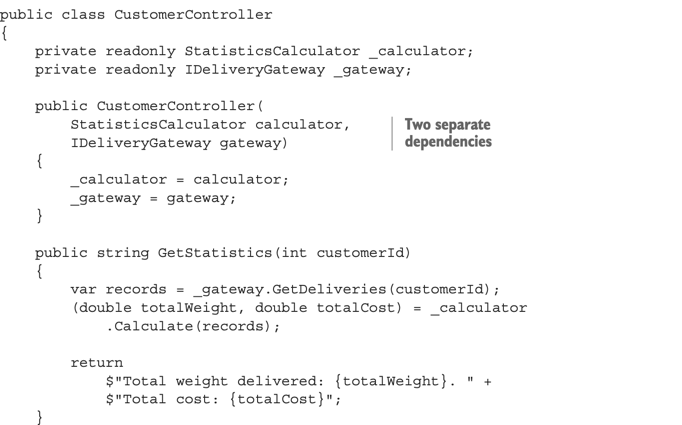

## 안티패턴

### 비공개 메서드 단위 테스트
 - private method를 테스트 하려고 노출하는건, 식별할 수 있는 동작만 테스트 하는것에 위반
 - private 메소드를 테스트 하는건, 구현 세부사항을 테스트 하는것과 동일하다
    - 떨어지는 리팩터링 내성
 - 종종 비공개 메소드가 너무 복잡해서, 테스트 커버리지에 영향을 미치는 경우가 있다.
    - 식별할 수 있는 코드에 이미 충분한 테스트를 하고 있으면 둘중 하나이다. (?) 
        - 죽은코드라는 신호.
        - 누락된 추상화! (비공개 메소드가 너무 복잡하면 별도의 클래스를 만들었어야 했다.)
    
비공개 메소드 테스트가 타당할 때
 - 기본적으로 식별할수 있는 동작을 public, 구현 세부 사항을 private으로 하는게 잘 설계된 api
 - private인데, 식별할 수 있는 동작일 때가 있다.
    - ORM 을 사용할 때, Entity를 protected로 하는 그런것들
    - 어디선가 Reflection을 이용하기 때문에 할수는 있음
    - Inquiry 예시
    


 - 위 코드에서, 비공개 생성자를 사용중
 - 이 생성자는 ORM과의 계약을 지키며, 생성자가 비공개라고 해서 계약이 덜 중요하지는 않다. (?)
 - 이러한 경우에 생성자를 공개한다고 해서 테스트가 쉽게 깨지지는 않는다.
    - 이해가 안가는데, 테스트를 위해 돌아가는 코드를 건드리는건 나쁜거 아닌가?
 - 리플렉션을 통해 테스트해도 가능하다.

---
### 비공개 상태 노출
 - 안티 패턴으로는 비공개 상태 노출이 있다.
 - 테스트를 위해 Field 를 노출하는 것


 - 위 코드에서 promote() 메서드를 테스트 하기 위해 status field를 노출하는것에 관해
   - promote()를 테스트 하기 위해서는 status field가 노출되어야 한다.
 - 여기서 코드는, 사용자의 상태를 신경쓰는 게 아니라, promote의 discount 관련된 내용만을 계산한다.
 - 그래서 식별할 수 있는 동작으로는, 할인 관련된 정보만 중요해서 해당 부분만 테스트
    - 새로 생성된 고객은 할인이 없다.
    - 업그레이드 시 5% 할인율
 - 나중에 다른 코드에서 고객 상태 필드를 사용하기 시작하면, SUT 의 식별할 수 있는 동작이 되기 떄문에 테스트에서 해당 필드를 결합할 수 있다.
   - 나중에 쓰게되면, status가 어떤식으로든 받을 수 있기 때문에, 사용한다는 의미인듯?
   - 다른데서 사용하게 된다면, status가 식별할 수 있는 부분이 되고 이에대한 메소드가 생겨서 그걸 테스트 할 수 있다?
   
---

###테스트로 유출된 도메인 지식
 - 알고리즘 테스트에서 종종 발생하는 안티패턴
 - 결과값을 만들 때, 구현부를 그대로 써서 만들고 이를 검증하는 코드

   
 - 이런 테스트는, 파라미터와 기대값을 한번에 보내서 처리해야한다.
 - 위 예제에서는 (11, 22, 33), (1,5, 6) 과 같이
 - 단위 테스트에서는 예상 결과를 하드코딩 하는것이 좋다.
   - 하드코딩 값은 SUT가 아닌 다른 것으로 미리 계산 (알고리즘이 복잡한 경우에)
   - 레거시 어플리케이션 리팩토링은, 레거시로 값을 만들어두고 그 값을 하드코딩으로 테스트!

---

### 코드 오염
 - 코드 오염은 테스트에만 필요한 제품 코드를 추가하는 것
 - boolean 값을 넣고 처리하는 경우가 많다.
   - if ("Test".equals("env")) 같은것도 마찬가지 일려나
 - 이는 제품의 유지보수 비용이 많이 올라가게 된다
 - 인터페이스를 이용해서, 실제 테스트 시에는 다른 구현체를 사용하게 해서 처리
   - 앞에서 나왔던 static logger 같은게 안티패턴인 이유.
   

---

### 구현체를 모킹
 - 이는 기존 기능을 유지하면서, 다른 구현을 할 수 있어 유용할 때가 있다.
 - 하지만 단일 책임 원칙 위반

   
 - getDeliveries()가 외부 의존성을 사용하므로, 이를 모킹처리
 - calculate()는 중요한 로직을 처리하기 때문에 기존 그대로 사용
 - 이는 실제로 비관리 의존성을 사용하는 부분과, 도메인로직이 결합된 결과이다.
   - 구현체를 목으로 처리하는 대신에 외부 의존성 gateway를 만들어 두 부분을 분리
 - 최후

   
 - 위 코드가 험블 객체 디자인 패턴의 실제 예와 같다.
```
- 험블 패턴이란?
   - 테스트 가능한 로직을 추출하여 테스트 하는것
   - 비즈니스 로직과, 프로세스 외부 의존성 통신을 분리
```

---

### 시간 처리하기
 - 시간에 따라 달라지는 기능을 테스트하면, 거짓 양성 발생할 수 있다.

시간처리하기 안티패턴
 - 앰비언트 컨텍스트
   - 프레임워크 내장 datetime.now() 대신, static 메소드로 처리하는 부분
   - 이는제품 코드를 오염시키고, 테스트를 더 어렵게 한다

시간처리하기 바람직한 방법
 - 명시적 의존성으로 시간 처리
   - 위의 static으로 만들어진 시간을, 명시적 의존성으로 처리하는 방법
   - DatetimeServer라는 클래스를 주입할수도, 메소드에 값으로 Datetime.now() 로 전달할 수도 있다.
      - 주로 후자로 처리, 테스트를 하다보면 시간값을 now()로 넣는 부분 떄문에 테스트가 불가한 경우가 많았다.
      - paramter로 기준되는 시간 값을 받고 그를 통해 처리하는게 조금 더 유연하고 테스트 편한 코드가 많았다.  
