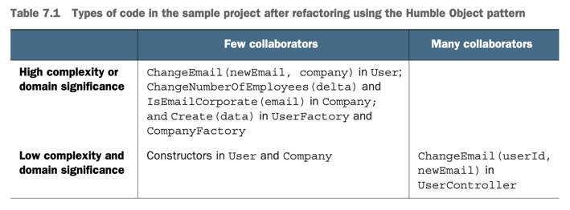

# 가치 있는 단위 테스트를 위한 **리팩터링**

 - 코드의 유형
   - 복잡도 Or 도메인 유의성
     - **도메인 유의성**
       - 프로젝트에 대해 얼마나 유의 있는지에 대한 지표. 일반적으로 도메인 계층의 모든 코드
       - 해당 코드에 단위 테스트에서 가장이롭다 (회귀방지 높음)
     - **복잡한 코드**
       - 복잡한 코드는 도메인 유의성이 낮아도 테스트 해야한다
       - 복잡한 코드라고 도메인 유의성이 꼭 높은건 아니다.
       - 그래도 테스트하면 이로운편
   - 협력자 수
     - **협력자 수**
       - 가변 의존성 이거나 외부 의존성
       - 테스트 비용을 올리는 주범
   - 협력자의 유형도 중요하다
     - 도메인 모델은 외부 협력자 사용 X
     - 협력자는 애플리케이션 부분에서만 사용
     - 5장 처럼 애플리케이션을 넘나느드는 부분만 사용
     - 
   - 위 두개의 지표(복잡도or도메인유의성 + 협력자 수)로 4개의 영역으로 코드를 분리
   - 
     - Trivial Code(간단한 코드)
       - 생성자, 한줄코드 등 테스트할 필요가 없다.
     - Controller
       - 컨트롤러 같은 경우네는 통합테스트로라도 간단히 테스트 해야한다.
       - 복잡도가 낮아 단위테스트의 부분에서는 제외?
     - 도메인 모델과 알고리즘
       - 테스트 하는 노력 대비 가장 이롭다.
       - 저렴하고 중요한 로직을 수행하기 때문에
     - 지나치게 복잡한 코드 (Overcomplicated code)
       - 가장 문제되는 부분
       - 테스트를 해야하는 부분이지만, 협력자가 많아 테스트를 못하기 때문에
       - 알고리즘 + 컨트롤러 (service + controller?) 로 나누는게 맞는건가
   - 위 이미지에서. 복잡한 코드를 Domain Model + Algorithms 와 Controllers 로 분리를 해야한다
   - 테스트 커버리지 100%가 목표가 아니라, **각각의 테스트가 프로젝트 가치를 높이는 테스트 스위트**
   - 다른 모든 테스트를 리팩터링 하거나 제거하라, 테스트 스위트의 크기를 부풀리지 말라
   - 좋지 않은 테스트를 작성하느니 테스트를 쓰지 않는게 좋다. (?)

### 험블 객체 패턴으로 복잡한 코드 분할하기
 - 험블 패턴이란?
   - 테스트 가능한 로직을 추출하여 테스트 하는것
   - 비즈니스 로직과, 프로세스 외부 의존성 통신을 분리
     - 육각형 아키텍쳐나, 함수형 아키텍처 모두 이 패턴을 구현한다.
     - 함수형은 더 나아가 의부 의존성뿐 아니라 모든 협력자와의 커뮤니케이션에서 비즈니스 로직을 분리
     - 
 - 험블 패턴으로 오는 이점
   - SRP(단일 책임 원칙)을 지키는 것
       - 비즈니스 로직과 오케스트레이션을 분리하는 경우
       - **코드가 깊거나, 넓은데 이 두가지를 분리하는건 너무나 중요**
           - 깊은건 복잡+도메인 관련, 넓은건 의존성 관련
   - 육각형, 함수형, MVP, MVC, DDD 도 이 패턴으로 구성
       - DDD의 클래스 내부는 강결합 이지만, 클러스터(Aggregation) 간의 관계는 느슨하다
---
### 예시로 보는 리팩터링
 - CRM 시스템으로 구현했다.
```
요구사항 : 이메일 변경 기능
 - 이메일 도메인이 회사면 직원으로 표시, 아니면 고객
 - 회사의 직원수를 추적
 - 이메일 변경 시 외부 시스템으로 메시지를 보낸다 (메시지 버스를 통해)
```

 - 초기 구현
   - User class 안에 모든 코드가 다 있는 경우
 ```java
 // 간단한 느낌만 구현

public class User {
    private int userId;
    private String email;
    private UserType userType;
    
    public void changeEmail(int userId,
            String newEmail,
            UserRepository userRepo,
            CompanyRepository companyRepo) {
        UserEntity userEntity = userRepo.findById(userId);
        this.userId = userEntity.getUserId();
        this.email = userEntity.getEmail();
        this.type = userEntity.getUserType();
        
        CompanyEntity companyEntity = companyRepo.getCompany(userEntity);
        String companyDomain = companyEntity.getDomain();
        // Domain 판단 
        boolean emailCorporate = this.email.split("@")[1].eqals(companyDomain);
        
        // company사용자 수 관련 처리
    }
}
```
   - 명시적 협력자는 userId, newEmail -> 값이라 협력자는 아님
   - 암시적 협력자 Database, MessageBus -> 외부 협력자
     - 도메인 유의성이 높은 코드에서 프로세스 외부 협력자는 사용하면 안된다.
     - User class는 OverComplicated code
---

### 위 코드 리팩터링 진행

 ### 1단계 : 암시적 의존성을 명시적으로 만들기
   - 기존 STatic으로 하던부분(위 예시에서는 생략)을 인터페이스로 주입한다.
   - 이렇게 하면 목 테스트는 가능해지지만, 테스트 유지비가 증가
 ### 2단계 : 애플리케이션 서비스 계층 도임
   - 도메인 클래스는 다른 도메인 클래스나, 단순 값과 같은 프로세스 내부 의존성에만 의존해야한다.
 ```java


public class UserController {
    private final Database db = new Database(); 
    private final MessageBus messageBus = new MessabeBus(); 
    
    public void changeEmail(int userId, String newEmail) {
        UserEntity userEntity = db.findUser(userId);
        User user = new User(UserEntity.id(),
                UserEntity.email(),
                UserEntity.type()
        );

        CompanyEntity company = db.getCompany(userEntity.company());
        String companyDomain = company.getDomain();
        // Domain 판단
        int numberEmp = company.getEmpCount();
        
        // company사용자 수 관련 처리 
        int newNumberOfEmp = user.changeEmail(newEmail, companyDomain, numberEmp);
        
        // message Bus 전송
        this.messageBus.send(userId, newEmail);
        
        this.db.save(user);
        this.db.save(company);
    }
}
```
   - 외부 의존성이 주입하지 않고 직접 인스턴스화
   - new User() 하는 부분은, 복잡한 로직이므로 애플리케이션 서비스(Controller)에 속하면 안된다. 
     - 애플리 케이션 서비스의 역할은 복잡도나 도메인 유의성 로직이 있으면 안됨 오직 오케스트레이션
   - user 도메인의 CHANGEEmail에서 new numberOfEmp 를 받아오는게 어색함, 잘못된 책임 부여
   - messageBus의 부실한 로직 처리
   - 현재 협력자는 그대로지만, 복잡도는 낮아져서(User로 이관) 기존보단 좋아짐

### 3단계 애플리케이션 서비스 복잡도 낮추기
 - UserFactory 로 복잡한 로직을 분리, 또는 ORM 생성
   - 해당 코드에선 복잡하진 않지만, 분리해두는 것이 좋다.
```java
public class UserFactory {
    public static User create(UserEntity userEntity) {
        UserFactory.valid(userEntity);
        User user = new User(UserEntity.id(),
                UserEntity.email(),
                UserEntity.type()
        );
        return user;
    }
    
    private static void valid(UserEntity entity) {
        assert entity.id() == null;
        assert entity.email() == null;
        assert entity.type() == null;
    }
}
```
 - 해당 부분으로 테스트가 쉬워짐
 - valid 가 추가되어 안전장치가 생김
 - 이는 도메인 유의성은 없는 코드 (유틸리티)
   - 이부분은 테스트 하지 않는건가?
   - 이부분은 생각보다 많은 예외가 있어, 테스트를 해볼법하다.

### 4단계 Company 관련 부분 빼기
 - 위에서의 단계로, Controller의 로직은 복잡하진 않지만 어색한 부분이 남아있다.
   - User.changeEmail() 에서 Company의 직원 수를 넘기고, 빼는게 굉장히 이상하다.
 - Company 도메인 클래스를 따로 추가
```java

public class Company {
    public boolean emailCorporate(String email) {
        // 구현부
    }
    public void changeNumberOfEmp(int number) {
        // 구현부
    }
}
```
 - 두개의 메소드
 - Tell Don't Ask 원칙을 지키는 방식 (getter로 불러오고, setter로 설정하지 않는 그런거)

```java
// 최종 코드 ORM 사용

@RequiredArgsConstructor
public class UserController {
    
    // DI 로 주입
    private final UserRepo userRepo;
    private final MessageBus mb;
    
    @Transactional
    public void chaneEmail(Long userId, String newEmail) {
        User user = this.userRepo.findById(userId);
        user.changeEmail(newEmail);
        mb.sendEvent(new UserEmailChageEvent(user));
    }
}

@Entity
public class User {
    private Long userId;
    private String email;
    private UserType type;
    
    @ManyToOne
    private Comapny company;
    
    public static enum UserType {
        EMP, OUTER
    }
    
    public void changeEmail(String email) {
        if (this.email.equals(email)) {
            return;
        }
        
        UserType newType = this.company.isEmailCorp(newEmail)
                ? UserType.EMP
                : UserType.OUTER;
        
        if (this.type != newType) {
             int changeNumber = newType == UserType.EMP ? 1 : -1;
             this.company.addEmpCount(changeNumber);
        }
        
        this.email = email;
        this.type = newType;
    }
    
}

@Entity
public class Company {
    
    private String emailDomain;
    private Integer empCount;
    
    public boolean isEmailCorp(String email) {
        return emailDomain.equals(email.split("@")[1]);
    }
    
    public void addEmpCount(int changeNumber) {
        this.empCount += changeNumber;
        this.validEmpCount();
    }
    
    private void validEmpCount() {
        if (empCount <= 0) {
            throw new IllegalArgException();
        }
    }
}
```

 - **위 부분으로 어색한 부분이 사라지고, Controller의 콜라보 하는 역할이 확연해 졌으며 외부 의존성도 하나로 잘 모이게 됨**
 - 위 부분으로 도메인 어떤것도 외부와 통신하지 않고, controller는 콜라보레이터의 역할만 진행한다.

### 위 구현 방식과, 이전 장의 함수형 아키텍처 간 비교
 - 기존 감사 시스템의 함수형 코어도, CRM의 도메인 계층도 프로세스 외부 의존성과 통신하진 않는다.
 - 부작용 처리 에서 차이가 발생
   - 함수형 코어는 부작용을 일으키지 않는다. (명령만 밖으로 돌리기 때문에)
   - CRM의 도메인 모델은 부작용이 있다.
     -  ORM을 사용한 부분에서 도메인 모델의 경계를 넘는것
     - 부작용의 대부분이 이메일과 직원 수의 형태로 모델에 남아있어 출력 기반 테스트를 진행할 수 있어 괜찮은 편
---

### 최적의 단위 테스트 커버리지 분석

 - User와 Company의 메소드를 테스트 하는건, 비즈니스 로직과 가장 관련이 있고 쉽기 떄문에 좋은 겨로가를 가지고 올 수 있다.
 - User의 생성자를 테스트 하는건 생각을 해봐야 할 일
   - Constructor에 생성관련 로직이 있는건 잘못된 방식인가 (?)
 - **전제 조건을 테스트**
   - User에 valid메소드가 있는데 테스트를 해야 하는가?
   - 일반적으로는 도메인 유의성이 있는 전제조건은 테스트를 해야한다.
   - (?) 왜 Comapny의 empCount는 도메인 유의성이 있고, DB의 값을 들고와서 valid하는것은 도메인 유의성이 없는가 
     - email을 업데이트한다는 기능 의미에서는, DB관련된 부분은 도메인과 관련이 없긴 하다.
---

### 컨트롤러에서 조건부 로직 처리
 - 비즈니스 로직과 오케스트레이션의 분리는 간단한 구조에서 가장 효과적이다
   - 여기서 말하는 간단한 구조란 DB 검색 -> 비즈니스 로직 -> 저장
 - 복잡한 경우네는 중간 결과를 기반으로 외부 의존성에 데이터를 조회 해야할 수도 있다.
 - 어떤 선택을 해야하는가? , 세가지 특성의 균형을 맞추는 선에서 결정
    1. 도메인 모델 테스트 유의성 : 도메인 클래스의 협력자 수와 유형에 따른 함수
    2. 컨트롤러 단순성: 의사 결정 지점이 있는거에 따라 다르다
    3. 성능 : 외부 의존성 호출에 대한 카운트
 - 복잡한 경우에 사용 가능한 방법
   - **읽기와 쓰기를 가장자리로**
     - 구조를 유지하지만, 성능이 저하 (필요 없는 컨트롤러가 프로세스 외부 의존성을 항상 호출)
     - 성능에 대한 포기
     - 성능에 대한 포기를 할수 없는 상용앱에서는 선택하기 힘든 방법
   - **도메인 모델에 프로세스 외부 의존성을 주입하고, 비즈니스 로직이 결정**
     - 컨트롤러를 단순하게 하지만, 도메인 모델의 테스트 유의성이 떨어진다
     - 도메인 모델에 외부 의존성 주입 : 너무 복잡한 클래스를 만들게 되어서, 사용 하지 않는다 (테스트도 어려워짐)
   - **프로세스를 더 세분화 하고, 각 단계별로 컨트롤러를 실행**
     - 단순한 컨트롤러를 포기할 수밖에 없다 (의사 결정 지점이 컨트롤러로 들어감)
     - 컨트롤러가 복잡해 지지만, 낮출 수 있는 방법이 있고, 테스트도 편하게 유지할 수 있어서 주로 채택

### 컨트롤러의 복잡도를 관리하는 방법
 - CanExecute/Execute 패턴 사용
   - 비즈니스 로직이 도메인 모델에서 컨트롤러로 유출하는 것을 방지
 - 하단 예시는, 사용자가 확인한 후에 이메일을 변경하려면 오류가 난다 (?)
 - 
```java
// 위와 동일한 부분은 생략
public class User {
    
    private boolean emailConfirmed; // Getter를 두는건, 파편화가 생길 수 있어 제외
    
    // 1번 예시 : 해당 메소드를 호출하고 밖에서 에러 메세지를 기반으로 MessageBus를 호출할지, DB를 결정할지에 대한 호출
    public String changeEmail(String newEmail) {
        if (this.emailConfirmed)
            return "Can't Change Email"; // Throw Excpetion으로 처리를 하면, 결정을 넘기긴 하는거겠지
        // 나머지 생략
    }
    
    // 파편화 메소드로 사용 x
    public boolean isEmailConfirmed() { return this.emailConfirmed; }

    // 2번 예시 : 아래 메소드를 이용해서, Controller에서 처리
    public boolean canChangeEmail() { return this.emailConfirmed; }
    
    public String changeEmail(String newEmail) {
        if (!this.canChangeEmail()) {
            return "Error";
        }
    }
    
}
```
 - 위 속성이 추가된 상태에서는 두가지 방법으로 분기
   1. User 클래스 안에서, 해당 분기로 처리
      - 이는 외부 의존성을 가장자리로 밀어낸 예시
      - 변경할 수 없을 떄에도 Company에 대한 조회가 필요 
        - 예시에는 User.changeEmail(String email, Company company) 로 Company도메인도 받고 있음
        - 그래도 실제로는 Company에 대한 LayLoading으로 괜찮을듯 한데.. 리스트가 커지거나 하면 문제가 생기겠지
      - 
   2. Controller에서 canChangeEmail() 같은 캡슐화된 메소드로 분기 처리
      - 메소드를 수행하는데 필요한 의존성을 모두 로드할 필요 없이, User안에서만 처리가 가능해서 성능의 향상
      - 컨트롤러는 더이상 이메일 변경 프로세스를 알 필요 없이 캡슐화된 메소드로 처리
      - Controller에 if문을 호출 할 필요가 없다. User에서 단위 테스트로 호출하기 때문에


### 도메인 이벤트를 사용해 도메인 변경 사항 추적
 - 애플리케이션에서 외부 시스템에 알리기 위해 종종 필요
 - 도메인 이벤트는 컨트롤러에서 의사 결정 책임을 제거하고 해당 책임을 도메인 모델에 적용함으로써 외부 시스템과의 통신에 대한 단위 테스트를 간결하게 함
 - **위 예제에서 email 이 변경되지 않은 경우에도 메세지를 보내는 오류를 고치려면**
 - 메세지를 보내는 부분을 컨트롤러에서 처리 할 수 있지만, 결정에 대한 로직이 들어갈 수 있어 문제
   - canChangeEmail() 과는 다른 메소드로, 결정에 대한 부분이 파편화 될 수 있다.
   - 그러나 애플리케이션이 프로세스 외부 의존성을 도메인 모델로 넘기지 않고 해당 의존성(프로세스 외부 의존성)을 불필요하게 호출해서 도메인 모델(???)을 오히려 지나치게 복잡하게 하는 것과 같이 더 어려운 상황이 될 수 있다. (???)
   - 너무 복잡하지 않게 하는 방법은 도메인 이벤트를 사용하는 것 뿐
   - 외부 시스템에 통보하는 데 필요한 데이터가 포함된 클래스로 도메인 이벤트를 작성


---
### 알아둬야할 기존 내용들
 - 1장의 Good Test Suite
   - 개발 주기 통합
   - 코드베이스중 중요한 부분 테스트
   - 최소한의 유지비로 최대한 가치
 - 4장의 4대요소
   - 회귀 방지, 리팩터링 내성, 빠른 피드백, 유지 보수성