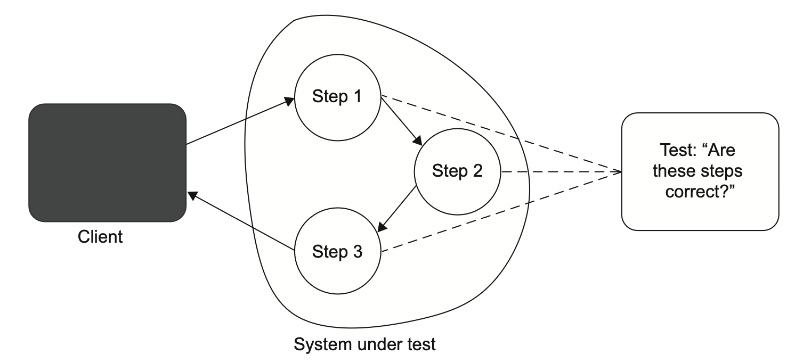
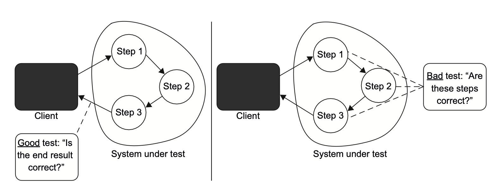
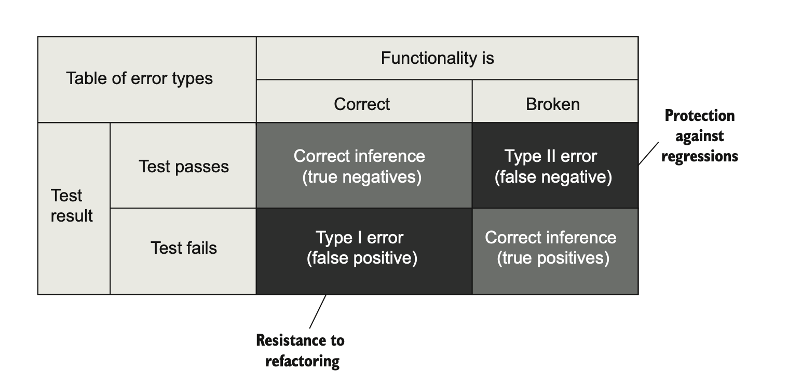
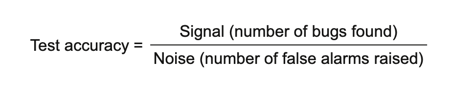
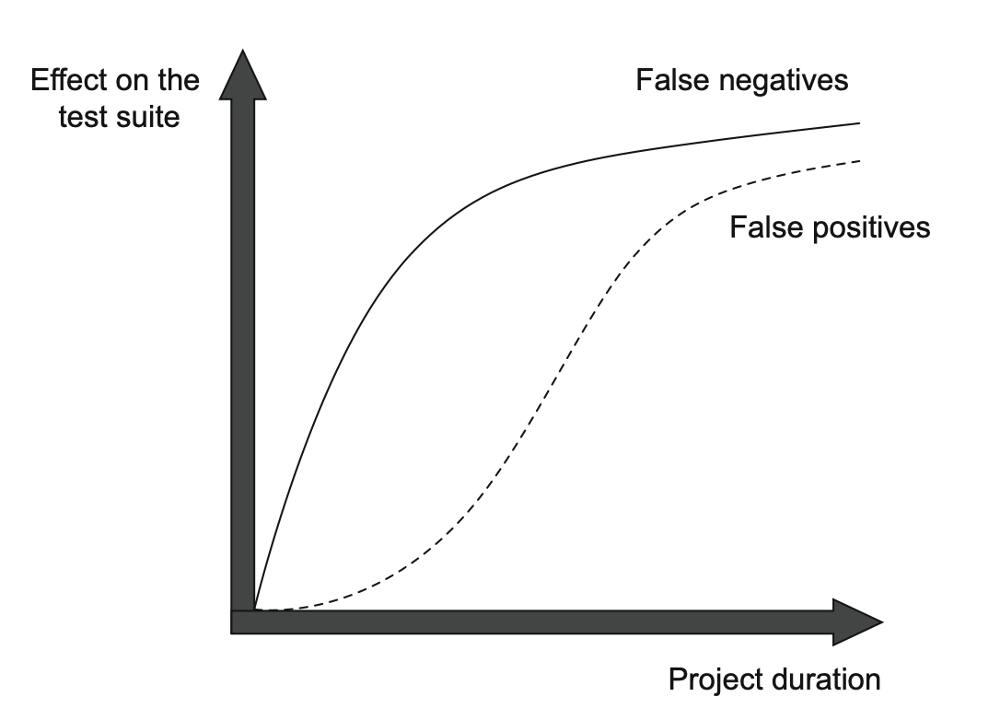
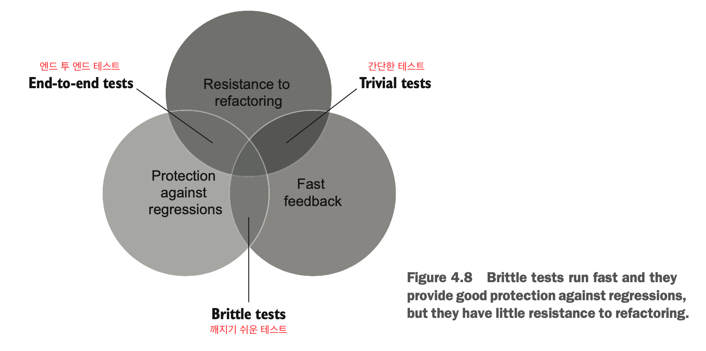
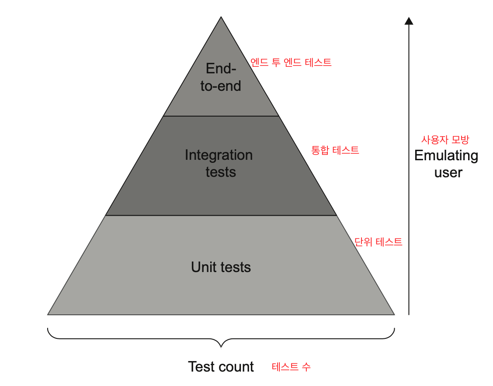
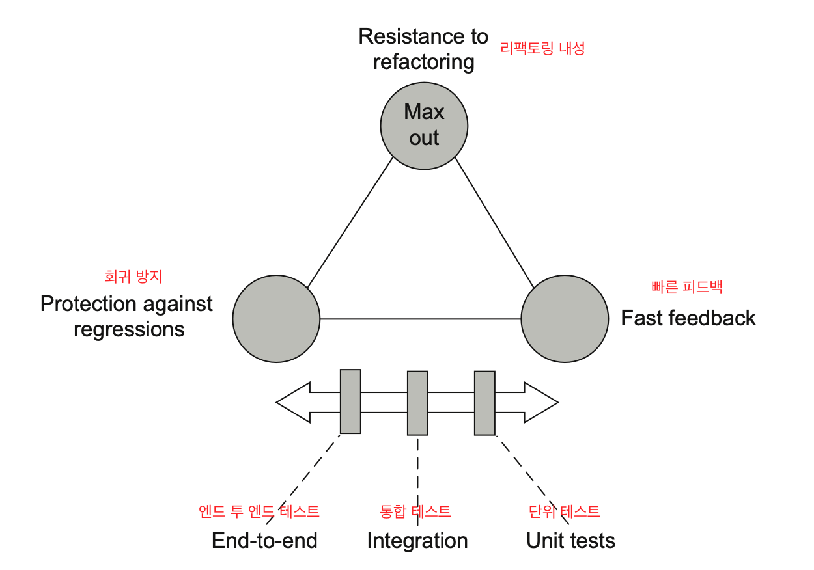
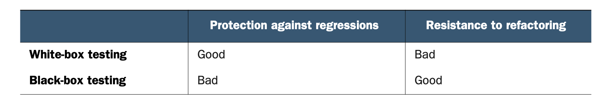

# 4장. 좋은 단위 테스트의 4대 요소

---

# 4장에서는

- 가치 있는 테스트를 식별하는 방법을 알아본다.
- 스위트의 모든 테스트를 분석할 수 있는 범용 기준을 소개한다.
- 대중적 단위 테스트 개념인 테스트 피라미드를 알아본다.
- 블랙박스 및 화이트박스 테스트를 살펴본다.

<br>


# 4.1 좋은 단위 테스트의 4대 요소 자세히 살펴보기

1. 회귀 방지 : Protection against regressions (bugs)
2. 리팩토링 내성 : Resistant to refactoring
3. 빠른 피드백 : Fast feedback
4. 유지 보수성 : Maintainability

## 4.1.1 첫 번째 요소 : 회귀 방지 - Protection against regressions (bugs)

- `회귀`란?
    - 소프트웨어 버그다.
    - 코드 수정 후 기능이 의도대로 작동하지 않는 경우

- 회귀 방지 지표에 대한 테스트 점수 평가 시 고려할 사항
    1. 테스트 중에 실행되는 코드의 양
    2. 코드 복잡도
    3. 코드의 도메인 유의성
    
- **테스트 중에 실행되는 코드의 양**
    - 일반적으로 실행 코드가 많을 수록 회귀가 발생할 확률이 높다.
- **코드 복잡도와 도메인 유의성**
    - 복잡한 비즈니스 로직을 가진 코드가 보일러 플레이트 코드보다 훨씬 중요하다.
    - 비즈니스에 중요한 기능에서 발생한 버그가 가장 큰 피해를 주기 때문이다.
- **가치가 없는 경우**
    - 단순한 코드 테스트하는 것
    - 짧고, 비즈니스 로직을 많이 담고있지 않기 때문이다.
    - 실수 여지가 적어서 회귀 오류가 많이 발생하지 않는다.
- **코드 외에 작성하지 않은 코드**
    - 예) 라이브러리, 프레임워크, 외부 시스템 등
    - 이러한 외부 코드를 테스트 범주에 포함시켜서 소프트웨어가 의존성에 대해 검증이 올바른지 확인한다.

- `TIP`
    - 회귀 방지 지표를 그댇화하려면 테스트가 가능한 한 많은 코드를 실행하는 것을 목표로 삼는다.

## 4.1.2 두 번째 요소 :  리팩터링 내성

- 테스트를 **빨간색(실패)** 으로 바꾸지 않고 기본 애플리케이션 코드를 리팩토링 할 수 있는지에 대한 척도
- 리팩토링
    - 비기능적 특징을 개선하여 가독성을 높이고 복잡도를 낮춤
- **`거짓 양성 (=false positive)`**
    - 허위 경보다.(?)
    - 기능은 의도한대로 작동하지만 테스트가 실패를 나타내는 경우다.
    - 구현을 수정하면서 식별할 수 있는 동작은 유지할 때 발생한다.
    - 리팩토링 내성 점수가 높으려면, 거짓 양성이 **적을수록** 좋다.
- 거짓 양성이 중요한 이유?
    - 전체 테스트 스위트에 치명적 영향을 줄 수 있다.
    - 테스트의 지속 가능한 성장 메커니즘은 **회귀없이 주기적으로 리팩토링하고 새로운 기능을 추가**하는 것이다.
- 거짓 양성 관리(?)의 장점
    - 조기 경고를 제공
        - 기존 기능이 고장난 경우  결함 코드를 발견하여 운영 배포 전 문제 해결
    - 코드 변경에 대한 확신
        - 회귀로 이어지지 않을 것이라고 확신할 수 있께 된다.
- 거짓 양성이 왜 문제가 될까?
    - 타당한 이유없이 테스트가 실패하면 문제 대응 능력과 의지가 희석된다.
    - 거짓 양성이 빈번하면 서서히 테스트 스위트에 대한 신뢰가 떨어진다.

## 4.1.3 무엇이 거짓 양성의 원인인가?

- 테스트 구성 방식과 직접적인 관련이 있다.
- 거짓 양성 발생 가능성을 줄이는 방법
    - 구현 세부 사항에서 테스트를 분리한다.
    - 테스트를 통해 SUT가 제공하는 **최종 결과를 검증**하는지 확인한다.
- 테스트 구성하기 가장 좋은 방법은? **문제 영역에 대해 이야기하는 것**이다.
    - 이런 테스트가 실패하면 이야기와 실제 애플리케이션 동작이 서로 분리되는 것을 의미
    - 테스트 실패 유형 중 유일하게 도움되는 유형이다!
        - 무엇이 잘못됐는지 빠르게 이해하는데 도움이 된다.
- **SUT의 구현 세부 사항과 결합한 테스트 예시**
    
    ```csharp
    [Fact]
    public void MessageRenderer_uses_correct_sub_renderers()
    {
        var sut = new MessageRenderer();
        IReadOnlyList<IRenderer> renderers = sut.SubRenderers;
    
    		Assert.Equal(3, renderers.Count);
        Assert.IsAssignableFrom<HeaderRenderer>(renderers[0]);
        Assert.IsAssignableFrom<BodyRenderer>(renderers[1]);
        Assert.IsAssignableFrom<FooterRenderer>(renderers[2]);
    }
    ```
    
    → 최종 결과는 바뀌지 않아도 테스트를 수행하면 실패할 것이다. 똑같이 적용할 수 있는 다른 구현을 고려하지 않고 특정 구현만 예상해서 알고리즘을 검사하고 있다.
    
- **SUT 알고리즘과 결합된 테스트**
    
    
    
    → 이런 테스트는 특정 구현(결과 전달을 위해 SUT가 수행해야 할 특정 단계)을 예상하므로 깨지기 쉽다. SUT의 구현을 리팩토링하면 모두 테스트 실패로 이어진다.
    
- SUT 세부 구현 사항과 결합된 테스트는 리팩토링 내성이 `없다`.
    - 회귀 발생 시 조기 경고를 제공하지 않는다.
    - 리팩토링에 대한 능력과 의지를 방해한다.

## 4.1.4 구현 세부 사항 대신 최종 결과를 목표로 하기

- `리팩토링 내성을 높이는 방법`
    - 구현 세부 사항과 테스트 간의 결합도를 낮춘다.
    - 클래스에서 얻을 수 있는 관찰 가능한 결과를 확인한다.
        - **테스트 예시**
            
            ```csharp
            [Fact]
            public void Rendering_a_message()
            {
                var sut = new MessageRenderer();
                var message = new Message
                {
                    Header = "h",
                    Body = "b",
                    Footer = "f"
            		};
            
                string html = sut.Render(message);
            
                Assert.Equal("<h1>h</h1><b>b</b><i>f</i>", html);
            }
            ```
            

- **결합 정도에 따라 나타는 차이점**
    
    
    
    → 왼쪽의 테스트는 구현 세부사항이 아닌 SUT 의 식별할 수 있는 동작과 결합된 상태로 리팩토링 내성이 있다. 거짓 양성이 거의 발생하지 않는다.

<br>


# 4.2 첫 번째 특성과 두 번째 특성 간의 본질적인 관계

- 회귀 방지와 리팩터링 내성 사이에는 본질적인 관계 있다. 정반대 관점에서도 테스트 스위트의 정확도에 기여한다.
- 이 둘은 시간이 흐르면서 프로젝트에 다른 방식으로 영향을 준다.
- 프로젝트 시작 직후는 회귀 방지가 중요시 되나, 리팩토링 내성은 그렇지는 않다.

## 4.2.1 테스트 정확도 극대화

- 회귀 방지와 리팩토링 내성 간의 관계. 회귀 방지는 거짓음성(2종 오류)에서 보호한다. 리팩토링 내성은 거짓양성(1종 오류)의 수를 최소화한다.
    
    
    
- 테스트가 통과하고 기본 기능이 의도한 대로 잘 작동하는 상황은 올바른 추론이다.
- 작동 기능과 통과 테스트의 조합에 대한 용어로 `‘참 음성(true negatives)’`이라고 한다.
- 마찬가지로 기능이 고장나서 테스트가 실패해도 **올바른 추론**이다.
    - 기능이 제대로 작동하지 않으면 테스트가 실패할 것으로 예상하기 때문
    - 이 상황에 해당하는 용어는 `‘참 양성(true positives)’`이다.

### 거짓 음성

- 테스트에서 오류가 발생하지 않는 경우
- 오른쪽 상단 사분면에 속하는 `‘거짓 음성(false negatives)’` 을 피하는 데 좋은 테스트는 첫 번째 특성인 `회귀 방지`가 도움이 된다.
- 이는 2종 오류인 거짓 음성의 수를 최소하는 데 도움이 된다.

### 거짓 양성

- `‘거짓 양성(false positives)’`를 피하는 데 두 번째 특성인 리팩토링 내성이 도움이 된다.

### 거짓 음성과 거짓 양성

- 이 둘의 확률이 낮을수록 테스트가 더 정확하다.
- 정확한 지표는 두 가지 요소로 구성된다
    1. 테스트가 버그 있음을 얼마나 잘 나타내는가(거짓 음성(회귀 방지 영역) 제외)
    2. 테스트가 버그 없음을 얼마나 잘 나타내는가(거짓 양성(리팩토링 내성 영역) 제외)
- 테스트 정확도를 향상시키는 방법은 두 가지가 있다.
    1. 신호를 증가시키는 것 → 회귀를 더 잘 찾아내는 테스트로 개선하는 것
    2. 소음을 줄이는 것 → 소음을 줄이는 것, 허위 경보를 발생시키지 않는 테스트로 개선하는 것
    
    
    
    **→ 가능한 한 소음(허위 경보)이 적은 강한 신호(버그를 찾을 수 있음)를 생성하면 테스트가 정확해진다.**
    
    **→ 둘 다 매우 중요하다. 허위 경보가 적어도 버그를 찾을 수 없는 테스트는 소용이 없다. 반대로 모든 버그를 찾아도 소음이 강하면 테스트 정확도는 0에 가까워진다.** 
    


## 4.2.2 거짓 양성과 거짓 음성의 중요성 : 역학 관계

- 단기적으로는 거짓 양성도 거짓 음성만큼 나쁘지는 않다.
- 그러나, 프로젝트가 성장함에 따라 거짓 양성은 테스트 스위트에 점점 더 큰 영향을 끼친다.
    
    
    
- 왜 초기에는 거짓 양성이 중요하지 않을까?
    - 리팩토링이 바로 중요하지는 않기 때문이다. (시간이 지나면서 점차 중요해진다.)
    - 정기적으로 리팩토링을 해야 한다. 그렇지 않으면 새로운 기능에 드는 비용이 엄청나게 커진다.
- 리팩토링이 점점 필요해짐에 따라 리팩토링 내성도 점점 중요해진다.
    - 회귀 방지에만 중점을 두는 경향이 있는데, 회귀 방지는 프로젝트 성장 유지에 도움이 되고 가치가 있지만 매우 정확한 테스트 스위트를 구축하기에는 충분하지 않다.
    - 중대형 프로젝트에서는 작업 시 거짓 음성(알려지지 않은 버그)과 거짓 양성(허위 경보)에 대해 똑같이 주의를 기울여야 한다.

<br>


# 4.3 세 번째 요소와 네 번째 요소 : 빠른 피드백과 유지 보수성

- 남은 두 가지 요소를 살펴본다.
    - 빠른 피드백
    - 유지 보수성
- 빠른 피드백은 단위 테스트의 필수 속성이다.
- 유지 보수성 지표는 유지비를 평가한다.
    - 테스트가 얼마나 이해하기 어려운가?
        - 코드 라인이 적을수록 읽기 더 쉽다.
        - 인위적으로 라인 수만 줄이는 것이 아니라고 가정할 때 작은 테스트는 필요할 때 변경하는 것이 쉽다.
        - 테스트 코드를 `‘일급 시민(first-class citizen)’` 취급해라.
        - 일급 시민(=일급 객체) : 3가지 조건을 충족한다.
            1. 변수나 데이터에 할당할 수 있어야 한다.
            2. 객체의 인자로 넘길 수 있어야 한다.
            3. 객체의 리턴값으로 리턴할 수 있어야 한다.
    - 테스트가 얼마나 실행하기 어려운가?
        - 테스트가 외부 종속성으로 작동하면, 의존성을 상시 운영하는 데 시간을 들여야 한다.

<br>


# 4.4 이상적인 테스트를 찾아서

- 좋은 단위 테스트의 4대 특성을 곱하면 테스트의 가치가 결정된다.
    
    ```java
    Value estimate = [0..1] * [0..1] * [0..1] * [0..1]
    ```
    
    **→ 가치가 있으려면 테스트는 4가지 범주에서 모두 점수를 내야한다.**
    
- 물론 정확하게 측정은 불가능하기 때문에 가치 추정치를 제시하는 것이다.
- 테스트 코드를 포함한 모든 코드는 **책임(liability)**이기 때문에 최소 필수값에 대해 상당히 높은 임계치를 설정하고 임계치를 충족하는 테스트만 테스트 스위트에 남겨야 한다.

## 4.4.1 이상적인 테스트를 만들 수 있는가?

- 이상적인 테스트는 4가지 모두에서 최대 점수를 받는 테스트다.
- 그러나 이는 불가능하다.
    - 각 특성이 상호 배타적이기 때문
    - 셋 중 하나를 희생해야 나머지 둘을 최대로 얻을 수 있다.

## 4.4.2 극단적인 사례 1 : 엔드 투 엔드 테스트

- 많은 코드를 테스트 하므로 회귀 방지를 훌륭히 해낸다.
- 거짓 양성에도 면역이 되어 리팩토링 내성도 우수하다.
- 그러나, 속도가 느리다.

## 4.4.3 극단적인 사례 2 : 간단한 테스트

- 간단한 테스트는 매우 빠르게 실행되어 빠른 피드백을 제공한다.
- 거짓 양성이 생길 가능성도 적기 때문에 리팩토링 내성도 우수하다.
- 그러나, 기반 코드에 실수 여지가 많지 않기 때문에 회귀를 나타내지 않는다.

## 4.4.4 극단적인 사례 3 : 깨지 쉬운 테스트

- 빠르게 실행된다.
- 회귀 방지를 훌륭히 해낸다.
- 그러나, 리팩토링 내성은 거의 없다.
- SQL 스크립트 테스트 예시이다.
    
    ```csharp
    public class UserRepository
    {
        public User GetById(int id)
        {
    				/* ... */ 
    		}
        public string LastExecutedSqlStatement { get; set; }
    }
    [Fact]
    public void GetById_executes_correct_SQL_code()
    {
        var sut = new UserRepository();
        User user = sut.GetById(5);
        Assert.Equal(
          "SELECT * FROM dbo.[User] WHERE UserID = 5",
          sut.LastExecutedSqlStatement
    		);
    }
    ```
    

## 4.4.5 이상적인 테스트를 찾아서 : 결론



- 나머지 특성 하나를 희생해야만 가능하다.
- 4번째 특성인 유지 보수성은 엔드 투 엔드 테스트를 제외하고 처음 세 가지 특성과 상관관계가 없다.
    - 테스트 관련 모든 의존성을 설정해야 하므로 일반적으로 크기가 더 크기 때문에 유지비 측면에서 더 비싸다.
- 실제로는 리팩토링 내성을 포기할 수는 없다.
    - 최대한 많이 갖는 것이 목표가 되어야 한다.
    - 회귀 방지 OR 빠른 피드백 사이에서 선택으로 절충이 귀결된다.
- 회귀 방지와 빠른 피드백 사이의 슬라이더
    
    
    

**→ 테스트 스위트를 탄탄하게 만들려면 테스트의 불안정성(거짓 양성)을 제거하는 것이 최우선 과제이다.**

### CAP 정리

- 일관성(consistency) : 모든 읽기가 가장 최근의 쓰기 또는 오류를 수신하는 것을 의미한다.
- 가용성(availability) : 모든 요청이 (시스템 내 전체 노드 중단은 제외하고) 응답을 수신하는 것을 의미한다.
- 분할 내성(partition tolerance) : 네트워크 분할(네트워크 노드 간 연결 끊김)에도 시스템이 계속 작동함을 의미한다.
- 좋은 단위 테스트 특성과 비슷한 점
    1. 세 가지 중 두 가지를 선택하는 절충안을 선택해야 한다.
    2. 대규모 분산 시스템의 분할 내성도 타협할 수 없다.(like 리팩토링 내성)


<br>


# 4.5 대중적인 테스트 자동화 개념 살펴보기

- 화이트박스 테스트 와 블랙박스 테스트 개념을 살펴보자.

## 4.5.1 테스트 피라미드 분해

- 테스트 피라미드란?
    - 테스트 스위트에서 테스트 유형 간의 일정한 비율을 일컫는 개념이다.
    
    
    
- 각 층의 너비는 테스트 스위트에서 해당 테스트가 얼마나 보편적인지를 나타낸다.
- 각 층의 높이는 이러한 테스트가 최종 사용자의 동작과 얼마나 유사한지 나타낸다.
- 상단으로 갈 수록 회귀 방지에 유리하며, 하단으로 갈 수록 실행 속도가 강조된다.



→ 피라미드의 테스트는 빠른 피드백과 회귀 방지 사이에서 선택한다. 엔드 투 엔드 테스트는 회귀 방지에 유리하고, 단위 테스트는 빠른 피드백을 강조하며, 통합 테스트는 그 중간에 있다.

→ 어떤 계층도 리팩토링 내성을 포기하지 않는다.

### 테스트 피라미드에서의 예외

- 비즈니스, 기타 복잡도가 거의 없는 기본적인 CRUD 작업인 경우
    - 단위 테스트와 통합 테스트 수가 같고 엔드 투 엔드 테스트가 없는 직사각형처럼 보인다.
    - 단위 테스트는 알고리즘이나 비즈니스 복잡도가 없는 환경에서 유용하지 않다.
    - 통합 테스트는 가치가 잘 지켜진다. 다른 하위 시스템과 통합되어 잘 작동하는지 확인하는 것이 중요하기 때문이다.
- 프로젝트 외부 의존성 하나만 연결하는 API 인 경우
    - 엔드 투 엔드 테스트를 더 많이 두는 것이 이런 애플리케이션에 적합한 옵션일 수 있다.
    - 사용자 인터페이스가 없으므로 엔드 투 엔드 테스트가 상당히 빠르게 실행된다.
    - 엔드 투 엔드 테스트와 통합 테스트를 구별할 수 없다. (유일한 차이가 진입점일 뿐)

## 4.5.2 블랙박스 테스트와 화이트박스 테스트 간의 선택

### 블랙박스 테스트

- 시스템 내부 구조를 몰라도 시스템의 기능을 검사할 수 잇는 소프트웨어 테스트 방법이다.
- ‘어떻게’가 아니라 ‘무엇’을 해야하는지를 중심으로 구축된다.

### 화이트박스 테스트

- 블랙박스와 정반대이다.
- 애플리케이션의 내부 작업을 검증하는 테스트 방식이다.
- 요구사항이나 명세가 아니라 소스 코드에서 파생된다.

### 두 방식의 장단점

- 화이트박스 테스트가 더 철저한 편이다.
    - GOOD : 외부 명세에만 의존할 때 놓칠 수 있는 오류를 발견할 수 있다.
    - BAD : 특정 구현과 결합되어 있어 깨지기 쉽다. → 거짓 양성을 많이 내고 리팩토링 내성 지표가 부족하다.
- 블랙박스 테스트는 이와 정반대이다.
- 테스트를 `작성`할 때는 블랙박스가 바람직하지만, 테스트를 `분석`할 때는 화이트박스 방식을 사용할 수 있다.
- 예외적으로, 알고리즘 복잡도가 높은 유틸리티 코드를 다루는 경우가 있다.(7장에서 설명)
    
    
    
    **→ 리팩토링 내성은 타협할 수 없기 때문에 블랙박스 테스트를 기본으로 선택해야 한다.**
    
    **→ 코드 커버리지 도구를 사용해서 어떤 코드 분기를 실행하지 않았는지 확인한 다음 코드 내부 구조에 대해 전혀 모르는 것처럼 테스트해라. 이 조합이 가장 효과적이다.**