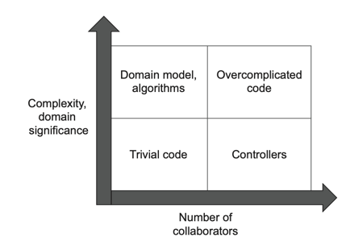

# 7장 가치 있는 단위 테스트를 위한 리팩터링

## 7.1 리팩터링할 코드 식별하기

### 7.1.1 코드의 네 가지 유형
* 제품 코드를 2차원으로 분류하는 법
  * 복잡도 또는 도메인 유의성
  * 협력자 수
* 복잡도 또는 도메인 유의성
  * 코드 복잡도<sup>code complexity</sup>: 코드 내 의사 결정(분기) 지점 수
  * 순환 복잡도 = 1 + <분기점 수>
  * 도메인 유의성<sup>domain significance</sup>: 코드가 문제 도메인에 대해 얼마나 의미 있는지
  * 도메인 계층의 모든 코드는 도메인 유의성이 높고, 유틸리티 코드는 도메인 유의성이 낮다.
  * 복잡도 또는 도메인 유의성이 높은 코드에 대한 단위 테스트가 중요하다. 이 테스트가 회귀 방지에 뛰어나기 때문이다.
    * 도메인 코드 - 복잡할 필요가 없다. (?)
    * 복잡한 코드 - 도메인 유의성이 없어도 테스트할만 하다.
* 협력자 수
  * 협력자 수가 많으면 테스트 비용이 많이 든다.
  * 협력자 수가 많으면 테스트 크기가 커지고, 테스트 크기가 커지면 유지 보수성이 떨어진다.
  * 도메인 클래스는 프로세스 외부 협력자를 사용하면 안된다. 즉, 프로세스 외부 의존성과의 통신은 도메인 계층 외부 클래스에 위임하는 것이 좋다.
  * 암시적 협력자와 명시적 협력자는 이 협력자 수에 포함된다. 불변 의존성(값 또는 값 객체)은 포함되지 않는다.
* 코드 복잡도, 도메인 유의성, 협력자 수의 조합으로 만들어지는 네 가지 코드 유형
    
  * 도메인 모델과 알고리즘
  * 간단한 코드
  * 컨트롤러
  * 지나치게 복잡한 코드
* 좌측 상단 - 도메인 모델 및 알고리즘
  * 이 테스트는 매우 가치 있고 저렴하다. 
  * 복잡하거나 중요한 로직을 수행하므로 회귀 방지가 좋다.
  * 코드에 협력자가 거의 없어서 유지 보수성이 좋다.
* 좌측 하단 - 간단한 코드
  * 테스트할 필요가 없다.
* 우측 하단 - 컨트롤러
  * 포괄적인 통합 테스트의 일부로서 간단히 테스트한다.
* 우측 상단 - 지나치게 복잡한 코드
  * 단위 테스트가 어렵지만 꼭 해야 한다.
  * 지나치게 복잡한 코드를 좌측 상단의 알고리즘과 우측 하단의 컨트롤러로 나눔으로서 딜레마를 해결할 수 있다.  

### 7.1.2 험블 객체 패턴을 사용해 지나치게 복잡한 코드 분할하기
* 프레임워크 의존성에 결합되어 테스트가 어려운 경우가 있다. (비동기, 멀티스레드, 사용자 인터페이스, 프로세스 외부 의존성 등)
* 테스트하기 어려울 때는 테스트가 가능한 부분을 추출해야 한다. 
* 코드는 테스트하기 어려운 의존성과 테스트 가능한 로직 부분을 이어주는 험블 래퍼<sup>humble wrapper</sup>가 된다.
* 험블 래퍼는 자체적인 로직이 거의 없으므로 테스트할 필요가 없다.
* 헥사고날 아키텍처와 함수형 아키텍처도 이 패턴을 사용한다.
  * 헥사고날 아키텍처
    * 비즈니스 로직과 프로세스 외부 의존성과의 통신을 분리한다.
    * 도메인 계층은 좌측 상단(도메인 모델)에 위치하고 애플리케이션 서비스 계층은 우측 하단(컨트롤러)에 위치한다.
  * 함수형 아키텍처
    * 비즈니스 로직과 모든 협력자와의 통신을 분리한다.
    * 함수형 코어는 좌측 상단(알고리즘)에 위치하고 가변 셸은 우측 하단(컨트롤러)에 위치한다.
* 단일 책임 원칙<sup>Single Responsibility principle</sup>도 이 패턴을 사용한다.
  * 각 클래스가 단일한 책임만 가져야 한다는 원칙
  * 그러한 책임 중 하나인 비즈니스 로직을 분리할 때 험블 객체 패턴을 사용하면 다른 것들과 분리할 수 있다.
* 비즈니스 로직과 오케스트레이션<sup>orchestration</sup>의 분리
  * 코드의 깊이(복잡 또는 중요), 코드의 너비(많은 협력자)가 둘 다 클 수는 없다.
  * 복잡하거나 중요한 코드인 도메인 계층은 코드의 깊이는 깊지만 코드의 너비는 좁다.
  * 협력자가 많은 컨트롤러는 코드의 깊이는 얕지만 코드의 너비는 넓다.
  * 험블 객체 패턴은 오케스트레이션을 수행하는 코드에서 복잡한 코드를 분리하도록 설계되었다. 
* MVP<sup>Model-View-Presenter</sup>와 MVC<sup>Model-Vies-Controller</sup> 패턴
  * 비즈니스 로직(Model), UI 관심사(View), 모델과 뷰 사이 조정(Presenter 또는 Controller)를 분리하는 패턴이다.
  * Presenter 또는 Controller 구성 요소는 험블 객체로, 뷰와 모델을 붙인다.
* 도메인 주도 설계<sup>Domain-Driven Design</sup>의 집계 패턴<sup>Aggregate pattern</sup>
  * 클래스를 클러스터로 묶어서 클래스간 연결을 줄이는 목표가 있는 패턴이다.
  * 클러스터 내의 클래스들은 강결합되어 있지만, 클러스터끼리는 느슨하게 결합되어 있다.
  * 이 구조는 코드베이스의 총 통신 수를 감소시키므로 테스트 용이성이 좋아진다.
* 이 패턴의 장점
  * 테스트 용이성이 좋아진다.
  * 코드 복잡도를 해결할 수 있다.
  * 장기적으로 프로젝트 성장에 중요한 역할을 한다. 즉, 유지 보수성이 좋아진다.

## 7.2 가치 있는 단위 테스트를 위한 리팩터링하기

### 7.2.1 고객 관리 시스템 소개
* 사용자 등록을 처리하는 고객 관리 시스템<sup>CRM, Customer Management System</sup>을 샘플 프로젝트로 사용한다.
* 현재 이 시스템이 지원하는 유스케이스 - 사용자 이메일 변경
```kotlin
class User(
    private var userId: Int,
    private var email: String,
    private var type: UserType,
) {

    fun changeEmail(userId: Int, newEmail: String) {
        val data = Database.getUserById(userId)
        this.userId = userId
        this.email = data!![1] as String
        this.type = data[2] as UserType

        if (newEmail == this.email) {
            return
        }

        val companyData = Database.getCompany()
        val companyDomainName = companyData!![0] as String
        val numberOfEmployees = companyData[1] as Int

        val emailDomain = newEmail.split('@')[1]
        val newType = when(emailDomain == companyDomainName) {
            true -> UserType.EMPLOYEE
            false -> UserType.CUSTOMER
        }

        if (newType != this.type) {
            val delta = when(newType) {
                UserType.EMPLOYEE -> 1
                else -> -1
            }
            val newNumber = numberOfEmployees + delta
            Database.saveCompany(newNumber)
        }

        this.email = newEmail
        this.type = newType

        Database.saveUser(this)
        MessageBus.sendEmailChangedMessage(userId, newEmail)
    }
}
```
*예제 7.1 CRM 시스템의 초기 구현*
* `changeEmail()`: 사용자를 직원/고객으로 식별하는 것, 회사의 직원 수 업데이트 등 두 가지 명시적 의사 결정 지점 있음
* `User` 클래스의 의존성
  * 명시적 의존성 -> argument 인 `userId`, `newEmail`
  * 암시적 의존성 -> 프로세스 외부 의존성인 `Database`, `MessageBus`
* 도메인 유의성이 높은 `User` 클래스는 프로세스 외부 의존성을 가져선 안되므로, 지나치게 복잡한 코드로 분류된다.
* 도메인 클래스가 스스로 데이터베이스를 검색하고 다시 저장하는 방식을 활성 레코드<sup>Active Record</sup> 패턴이라고 하는데, 단순/단기 프로젝트에서는 잘 작동하지만 확장성이 떨어진다. 두 가지 책임, 비즈니스 로직과 프로세스 외부 의존성과의 통신 사이에 분리가 없기 때문이다. 

### 7.2.2 1단계: 암시적 의존성을 명시적으로 만들기
* 암시적 의존성을 명시적으로 바꾸어 테스트 용이성을 개선해보자.
* `Database`와 `MessageBus`에 대한 인터페이스를 두고, 이 인터페이스를 `User` 에 주입한 후 테스트에서 목으로 처리한다.
* 하지만 해당 의존성은 테스트하려면 복잡한 목 체계가 필요하므로 테스트 유지비가 증가한다.
* 결국 도메인 모델은 직접적으로든 간접적으로든(인터페이스를 통해) 프로세스 외부 의존성에 의존하지 않는 것이 좋다. 이것이 헥사고날 아키텍처의 핵심이다.

### 7.2.3 2단계: 애플리케이션 서비스 계층 도입
* 도메인 모델과 외부 통신을 분리하려면 험블 컨트롤러(헥사고날 아키텍처의 애플리케이션 서비스)가 필요하다.
```kotlin
class UserController {

  private val database = Database()
  private val messageBus = MessageBus()

  fun changeEmail(userId: Int, newEmail: String) {
    val data = database.getUserById(userId)
    val email = data!![1] as String
    val type = data[2] as UserType
    val user = User(userId, email, type)

    val companyData = database.getCompany()
    val companyDomainName = companyData!![0] as String
    val numberOfEmployees = companyData[1] as Int

    val newNumberOfEmployees = user.changeEmail(newEmail, companyDomainName, numberOfEmployees)

    database.saveCompany(newNumberOfEmployees)
    database.saveUser(user)
    messageBus.sendEmailChangedMessage(userId, newEmail)
  }
}
```
*예제 7.2 애플리케이션 서비스, 버전 1*
* `User` 클래스로부터 프로세스 외부 의존성을 줄이는 시도를 했다.
* 이 구현에는 몇 가지 문제가 있다.
  * 프로세스 외부 의존성(`Database`, `MessageBus`)이 주입되지 않고 직접 인스턴스화 된다. 통합 테스트에서 문제가 된다.
  * 컨트롤러는 데이터베이스에서 받은 원시 데이터를 User 인스턴스로 재구성한다. 이 로직은 복잡한 로직이므로 애플리케이션 서비스에 있으면 안된다.
  * `user.changeEmail()` 메소드는 회사의 업데이트된 직원 수를 리턴하는데 이 값은 특정 user 와 관련이 없다. 이 책임은 다른 곳에 있어야 한다.
  * 컨트롤러는 새로운 이메일이 전과 다른지 확인하지 않고 저장한 후 메시지 버스에 알림을 보낸다.
* 리팩토링 후 `User` 클래스는 도메인 모델 사분면에서도 수직축에 가깝게 이동했다. (협력자 없으므로)
* 리팩토링 후 `UserController` 클래스는 컨트롤러 사분면으로 들어갔지만 아직 로직이 복잡해서 지나치게 복잡한 코드와의 경계에 있다.

### 7.2.4 3단계: 애플리케이션 서비스 복잡도 낮추기
* `UserController` 의 복잡성을 덜어내려면 재구성 로직을 추출해야 한다.
* ORM<sup>Object-Relational Mapping</sup> 라이브러리를 사용해서 데이터베이스를 도메인 모델에 매핑하면, 재구성 로직을 적절한 곳으로 옮길 수 있다.
* ORM 이 아닌 다른 방법으로는, 도메인 모델에 원시 데이터베이스 데이터로 도메인 클래스를 인스턴스화하는 팩토리 클래스를 작성할 수 있다.
* 기존 도메인 클래스의 정적 팩토리 메서드로도 구현이 가능하지만 별도 클래스로 분리하는 것이 좋다.
```kotlin
class UserFactory {

  companion object {
    fun create(data: Array<Any>): User {
      require(data.size >= 3)

      val id = data[0] as Int
      val email = data[1] as String
      val type = data[2] as UserType

      return User(id, email, type)
    }
  }
}
```
*예제 7.3 User 팩토리 클래스*
* 이 재구성 로직은 다소 복잡하지만 도메인 유의성이 없다.
* 즉, 사용자 이메일을 변경하려는 클라이언트의 목표와 직접적인 관련이 없다.
* 유틸리티 코드의 예시이다.
* 재구성 로직은 내부적으로 캐스팅 실패 시 예외를 던지는 숨은 분기가 있으므로 테스트해볼만 하다.

### 7.2.5 4단계: 새 Company 클래스 소개
```kotlin
        val companyData = database.getCompany()
        val companyDomainName = companyData!![0] as String
        val numberOfEmployees = companyData[1] as Int

        val newNumberOfEmployees = user.changeEmail(newEmail, companyDomainName, numberOfEmployees)
```
* `user.changerEmail()` 메소드가 업데이트된 직원 수를 반환하는 부분이 어색하다. -> 책임을 잘못 뒀다, 추상화가 없다를 의미
* 다음 예제와 같이 회사 관련 로직과 데이터를 함께 묶는 또 다른 도메인 클래스인 `Company`를 만들자.
```kotlin
class Company(
    private val domainName: String,
    private var numberOfEmployees: Int,
) {
    fun changeNumberOfEmployees(delta: Int) {
        require(numberOfEmployees + delta >= 0)
        numberOfEmployees += delta
    }
    
    fun isEmailCorporate(email: String): Boolean {
        val emailDomain = email.split('@')[1]
        return emailDomain == domainName
    }   
}
```
*예제 7.4 도메인 계층의 새로운 클래스*
* `User` 인스턴스는 직원 수를 변경하거나 특정 이메일이 회사 이메일인지 여부를 파악하도록 `Company`에 말한다.
* `Company`는 원시 데이터를 묻지 않고 모든 작업을 자체적으로 수행한다. (데이터를 연산 기능과 결합하는 '묻지 말고 말하라<sup>tell-don't-ask</sup>'는 원칙을 준수한다.)
```kotlin
class UserController {

    private val database = Database()
    private val messageBus = MessageBus()

    fun changeEmail(userId: Int, newEmail: String) {
        val data = database.getUserById(userId)
        val user = UserFactory.create(data!!)

        val companyData = database.getCompany()
        val company = CompanyFactory.create(companyData!!)

        user.changeEmail(newEmail, company)

        database.saveCompany(company)
        database.saveUser(user)
        messageBus.sendEmailChangedMessage(userId, newEmail)
    }
}
```
*예제 7.5 리팩터링 후 컨트롤러*
```kotlin
class User(val userId: Int, email: String, type: UserType) {

    var email: String = email
        private set
    var type: UserType = type
        private set

    fun changeEmail(newEmail: String, company: Company) {

        if (newEmail == this.email) {
            return
        }

        val newType = when(company.isEmailCorporate(newEmail)) {
            true -> UserType.EMPLOYEE
            false -> UserType.CUSTOMER
        }

        if (newType != this.type) {
            val delta = when(newType) {
                UserType.EMPLOYEE -> 1
                else -> -1
            }
            company.changeNumberOfEmployees(delta)
        }

        this.email = newEmail
        this.type = newType
    }
}
```
*예제 7.6 리팩터링 후 User*
* 잘못 둔 책임(회사 데이터를 직접 처리하는 로직)을 제거했다.
* `Company`, `UserFactory`, `CompanyFactory`는 도메인 모델 사분면에서도 협력자 수가 없는 수직선 쪽에 위치한다.
* `User`에는 협력자가 이전에 없었지만 `Company`가 생기면서 도메인 모델 사분면에서도 조금 오른쪽으로 이동했다.
* `UserController`는 복잡도가 팩토리로 옮겨가면서 컨트롤러 사분면에 안정적으로 위치한다.
* 이전 장 감사 시스템의 함수형 코어와 이번 장 CRM 의 도메인 계층의 비교
  * 공통점
    * 프로세스 외부 의존성과 통신하지 않는다.
    * 애플리케이션 서비스 계층이 프로세스 외부 의존성과 통신을 담당한다.
  * 차이점
    * 사이드 이펙트 처리
      * 감사 시스템의 함수형 코어는 사이드 이펙트를 일으키지 않는다.
      * CRM 의 도메인 모델은 사이드 이펙트를 일으키지만, 이러한 모든 사이드 이펙트는 변경된 사용자 이메일과 직원 수의 형태로 도메인 모델 내부에 남아있다. 컨트롤러가 `User`, `Company` 객체를 데이터베이스에 저장할 때만 사이드 이펙트가 도메인 모델의 경계를 넘는다. -> 사이드 이펙트가 메모리에 남아있기 때문에 프로세스 외부 의존성까지 테스트할 필요가 없어서 테스트 용이성이 올라간다.

## 7.3 최적의 단위 테스트 커버리지 분석
|                     |                                                       협력자 적음                                                       |             협력자 많음              |
|---------------------|:------------------------------------------------------------------------------------------------------------------:|:-------------------------------:|
| **복잡도와 도메인 유의성 높음** | `User`의 `changeEmail`,<br/>`Company`의 `changeNumberOfEmployees`, `isEmailCorporate`<br/>`CompanyFactory`의 `create` |                                 |
| **복잡도와 도메인 유의성 낮음** |                                               `User`와 `Company`의 생성자                                               | `UserController`의 `changeEmail` |
*표 7.1 샘플 프로젝트를 험블 객체 패턴으로 리팩터링 한 후의 코드 유형*

### 7.3.1 도메인 계층과 유틸리티 코드 테스트하기
* *표 7.1*의 좌측 상단 - 테스트 비용 편익 최상!
* 코드의 복잡도나 도메인 유의성이 높으면 회귀 방지가 뛰어나다.
* 협력자가 거의 없어 유지비도 가장 낮다.

### 7.3.2 나머지 세 사분면에 대한 코드 테스트하기
* *표 7.1*의 좌측 하단 - 단순하고 회귀 방지가 떨어져서 테스트할 필요가 없다.

### 7.3.3 전제 조건을 테스트해야 하는가?
```kotlin
    fun changeNumberOfEmployees(delta: Int) {
        require(numberOfEmployees + delta >= 0)
        numberOfEmployees += delta
    }
```
* 전제 조건은 예외 상황(버그)에서만 활성화되는 보호 장치다.
* 전제 조건 중에는 도메인 유의성이 있는 것들만 테스트하자.

## 7.4 컨트롤러에서 조건부 로직 처리
* 비즈니스 로직과 오케스트레이션의 분리는 비즈니스 연산이 다음 세 단계로 있을 때 가장 효과적이다.
  * 저장소에서 데이터 검색
  * 비즈니스 로직 실행
  * 데이터를 다시 저장소에 저장
* 위의 세 단계로 명확하지 않은 경우 해결방법
  * 외부에 대한 읽기와 쓰기를 가장자리로 밀어낸다. 하지만 필요 없는 경우에도 컨트롤러가 프로세스 외부 의존성을 호출하므로 성능이 저하된다.
    * 도메인 모델 테스트 유의성(도메인 클래스의 협력자 수와 유형에 따른 함수) -> 좋음
    * 컨트롤러 단순성(분기 여부) -> 좋음
    * 성능(프로세스 외부 의존성에 대한 호출 수) -> 나쁨 (프로세스 외부 의존성을 호출하므로)
  * 도메인 모델에 프로세스 외부 의존성을 주입하고 비즈니스 로직이 해당 의존성을 호출할 시점을 직접 결정할 수 있게 한다.
    * 도메인 모델 테스트 유의성 -> 나쁨 (프로세스 외부 의존성이 생기므로)
    * 컨트롤러 단순성 -> 좋음
    * 성능 -> 좋음
  * 의사 결정 프로세스를 더 세분화하고, 각 단계별로 컨트롤러를 실행하도록 한다.
    * 도메인 모델 테스트 유의성 -> 좋음
    * 컨트롤러 단순성 -> 나쁨 (컨트롤러에 의사 결정 지점이 생기므로)
    * 성능 -> 좋음
* 첫 번째 방법 - 대부분의 프로젝트에서는 성능이 중요하므로 탈락
* 두 번째 방법 - 코드가 지나치게 복잡해지고 테스트와 유지 보수가 어려워지므로 탈락
* 세 번째 방법 - 컨트롤러가 지나치게 복잡한 코드 사분면에 가까워지지만 그 복잡도를 관리할 수 있다!! 

### 7.4.1 CanExecute/Execute 패턴 사용
* 컨트롤러 복잡도가 커지는 것을 완화하는 첫 번째 방법 - CanExecute/Execute 패턴 사용
* 비즈니스 로직이 도메인 모델에서 컨트롤러로 유출되는 것을 방지하는 방법이다.
* 사용자가 확인하기 전에만 이메일을 변경할 수 있는 유스케이스가 생긴다고 생각해보자.
```kotlin
class User(val userId: Int, email: String, type: UserType, isEmailConfirmed: Boolean) {
  var email: String = email
    private set
  var type: UserType = type
    private set
  var isEmailConfirmed: Boolean = isEmailConfirmed
    private set
  /* ... */
}
```
*예제 7.7 새 속성이 추가된 User*
* 사용자가 확인했는지를 체크할 위치를 정하는 두 가지 옵션이 있다.
```kotlin
    fun changeEmail(userId: Int, newEmail: String): String {
        val data = database.getUserById(userId)
        val user = UserFactory.create(data!!)

        val companyData = database.getCompany()
        val company = CompanyFactory.create(companyData!!)

        val error = user.changeEmail(newEmail, company)
        error ?.let { return error }

        user.changeEmail(newEmail, company)

        database.saveCompany(company)
        database.saveUser(user)
        messageBus.sendEmailChangedMessage(userId, newEmail)

        return "OK"
    }
```
*예제 7.8 모든 의사 결정을 제거한 컨트롤러*
* 첫 번째 옵션 - `User`의 `changeEmail` 메서드에 넣는다.
  * 컨트롤러가 의사 결정을 하지는 않지만, `isEmailConfirmed`가 `true`인 경우에도 무조건 데이터베이스에서 `Company`를 검색하므로 성능이 저하된다.
  * 이 옵션은 모든 외부 읽기와 쓰기를 비즈니스 연산 끝으로 밀어내는 예다.
```kotlin
    fun changeEmail(userId: Int, newEmail: String): String {
        val data = database.getUserById(userId)
        val user = UserFactory.create(data!!)

        if (user.isEmailConfirmed) {
          return "Can't change email after it's confirmed"
        }
  
        val companyData = database.getCompany()
        val company = CompanyFactory.create(companyData!!)

        user.changeEmail(newEmail, company)

        database.saveCompany(company)
        database.saveUser(user)
        messageBus.sendEmailChangedMessage(userId, newEmail)

        return "OK"
    }
```
*예제 7.9 사용자의 이메일을 변경할지 여부를 결정하는 컨트롤러*
* 두 번째 옵션 - `isEmailConfirmed` 체크 로직을 `User`에서 컨트롤러로 옮긴다.
  * `isEmailConfirmed`가 `false` 일 때만 데이터베이스에서 `Company`를 검색하므로 성능이 유지된다.
  * 하지만 의사 결정 프로세스가 두 부분으로 나뉜다. 이메일 변경 진행 여부 + 변경 시 해야 할 일
  * 도메인 모델의 캡슐화가 떨어진다. (파편화) -> 비즈니스 로직과 오케스트레이션 간의 분리가 방해된다.
  * 파편화 방지를 위해 `User`에 새 메서드 `canChangeEmail()`을 둬서 이 메서드가 잘 실행되는 것을 이메일 변경의 전제 조건으로 한다.
```kotlin
  fun canChangeEmail(): String? {
    if (isEmailConfirmed) { 
      return "Can't change email after it's confirmed"
    }
    return null
  }

  fun changeEmail(newEmail: String, company: Company) {
    require(canChangeEmail() == null)

    /* ... */
  }
```
*예제 7.10 CanExecute/Execute 패턴을 사용한 이메일 변경*
* 이 방법의 두 가지 중요한 이점
  * 컨트롤러는 이제 이메일 변경 프로세스를 알지 않아도 된다. `canChangeEmail`만 잘 호출하면 된다.
  * `changeEmail()`의 전제 조건을 먼저 확인하지 않으면 이메일을 변경할 수 없도록 한다. 
* 이 패턴을 사용하면 도메인 계층의 모든 결정을 통합할 수 있다. 컨트롤러에서 `canChangeEmail`을 호출해도 테스트할 필요가 없다. `User` 클래스의 전제 조건만 단위 테스트해도 된다.

### 7.4.2 도메인 이벤트를 사용해 도메인 모델 변경 사항 추적
* 도메인 모델에서 일어나는 중요한 변경 사항들을 추적하기 위해 도메인 이벤트<sup>domain event</sup>를 사용할 수 있다.
* 도메인 이벤트
  * 애플리케이션 내에서 도메인 전문가에게 중요한 이벤트
  * 도메인 전문가에게는 무엇으로 도메인 이벤트와 일반 이벤트를 구별하는지가 중요하다.
  * 도메인 이벤트는 종종 시스템에서 발생하는 중요한 변경 사항을 외부 애플리케이션에 알리는 데 사용된다.
* CRM 도 추적 요구 사항이 있다. 메시지 버스에 메시지를 보내서 외부 시스템에 변경된 사용자 이메일을 알려준다. 현재는 이메일이 변경되지 않아도 메시지를 보낸다.
* 이메일이 같은지 검사하는 부분을 컨트롤러에 두면 비즈니스 로직이 파편화 된다.
* 애플리케이션이 프로세스 외부 의존성을 도메인 모델로 넘기지 않고 직접 호출하면 도메인 모델이 지나치게 복잡해질 수도 있다.
* 도메인 이벤트 -> 외부 시스템에 통보하는 데 필요한 데이터가 포함된 클래스
* 샘플 프로젝트인 CRM 에서는 메시지 버스에 바뀐 이메일을 통보하기 위해 필요한 정보인 userId 와 이메일 데이터가 포함된 클래스
* [참고] 도메인 이벤트는 이미 일어난 일들을 나타내기 때문에 항상 과거 시제로 명명해야 한다. 또한 불변이다.
```kotlin
    fun changeEmail(newEmail: String, company: Company) {

        require(canChangeEmail() == null)

        if (newEmail == this.email) {
            return
        }

        val newType = when(company.isEmailCorporate(newEmail)) {
            true -> UserType.EMPLOYEE
            false -> UserType.CUSTOMER
        }

        if (newType != this.type) {
            val delta = when(newType) {
                UserType.EMPLOYEE -> 1
                else -> -1
            }
            company.changeNumberOfEmployees(delta)
        }

        this.email = newEmail
        this.type = newType

        this.emailChangedEvents += EmailChangedEvent(userId, newEmail)
    }
```
*예제 7.12 이메일이 변경될 때 이벤트를 추가하는 User*
```kotlin
    fun changeEmail(userId: Int, newEmail: String): String {
        val data = database.getUserById(userId)
        val user = UserFactory.create(data!!)

        val companyData = database.getCompany()
        val company = CompanyFactory.create(companyData!!)

        val error = user.canChangeEmail()
        error ?.let { return error }

        user.changeEmail(newEmail, company)

        database.saveCompany(company)
        database.saveUser(user)
        for (emailChangedEvent in user.emailChangedEvents) {
            messageBus.sendEmailChangedMessage(emailChangedEvent.userId, emailChangedEvent.newEmail)
        }

        return "OK"
    }
```
*예제 7.13 도메인 이벤트를 처리하는 컨트롤러*
* 데이터베이스 저장 로직은 해당 데이터베이스가 CRM 으로만 접근이 가능하다면 구현 세부 사항이다.
* 반면에 메시지 버스와의 통신은 식별할 수 있는 동작이다.
* 비즈니스 요건 상 CRM 은 이메일이 변경될 때만 메시지를 메시지 버스에 넣어야 하지만, 데이터베이스는 이메일 변경 여부와 상관 없이 저장한다 해도 성능 영향이 상대적으로 미미하다.
* 데이터베이스와 이메일 변경 메시지 등의 요건을 도메인 이벤트로 일반화 해서 해결해보자.
  * `DomainEvent`라는 베이스 클래스를 기반으로 도메인 이벤트들을 만들고 이를 관리하는 식으로...
* 도메인 이벤트는 컨트롤러에서 의사 결정 책임을 제거하고 해당 책임을 도메인 모델에 적용함으로써 외부 시스템과의 통신에 대한 단위 테스트를 간결하게 한다.
```kotlin
    @Test
    fun `changing email from corporate to non corporate`() {
        val company = Company("mycorp.com", 1)
        val sut = User(1, "user@mycorp.com", UserType.EMPLOYEE, false)

        sut.changeEmail("new@gmail.com", company)

        assertThat(company.numberOfEmployees).isEqualTo(0)
        assertThat(sut.email).isEqualTo("new@gmail.com")
        assertThat(sut.type).isEqualTo(UserType.CUSTOMER)
        assertThat(sut.emailChangedEvents).isEqualTo(listOf(EmailChangedEvent(1, "new@gmail.com")))
    }
```
*예제 7.14 도메인 이벤트 생성 테스트*
* 컨트롤러를 검증하고 프로세스 외부 의존성을 목으로 대체하는 대신, 이 예제처럼 단위 테스트에서 직접 도메인 이벤트 생성을 테스트할 수 있다.

## 7.5 결론
* 이 장의 주제 -> 외부 시스템에 대한 애플리케이션의 사이드 이펙트를 추상화하는 것!
* 비즈니스 연산이 끝날 때까지 이러한 사이드 이펙트를 메모리에 둬서 추상화하면 단위 테스트를 쉽게 할 수 있다.
* 도메인 이벤트 = 도메인 클래스의 변경 사항 = 향후 프로세스 외부 의존성에 적용할 수정 사항에 대한 추상화
* 도메인 이벤트와 CanExecute/Execute 패턴을 사용해도 비즈니스 로직 파편화가 불가피한 상황이 있다.
  * 도메인 모델에 프로세스 외부 의존성을 두지 않고는 컨트롤러 외부에서 이메일 고유성을 검증할 수 없다.
  * 비즈니스 연산 과정을 변경해야 하는 프로세스 외부 의존성의 실패(?) <-- 무슨 의미인지...
* 도메인 클래스에는 프로세스 외부 의존성을 제외한 협력자가 있어도 괜찮다.
  * 하지만 이 협력자들에 대해 목으로 단위 테스트를 하지는 말라. 이 협력자들과의 상호 작용은 구현 세부 사항이다.
* CRM 의 식별할 수 있는 동작
  * 클라이언트를 외부 클라이언트로 볼 때
    * `UserController`의 `changeEmail` 메서드 (외부 클라이언트의 진입점)
    * 메시지 버스에 대한 호출 (외부에서도 볼 수 있는 프로세스 외부 의존성의 사이드 이펙트)
  * 클라이언트를 컨트롤러로 볼 때
    * `User`의 `changeEmail` 메서드 (클라이언트의 목표와 직접 연관)
    * `User`에서 `Company`로 가는 후속 호출은 컨트롤러의 관점에서 구현 세부 사항이다.