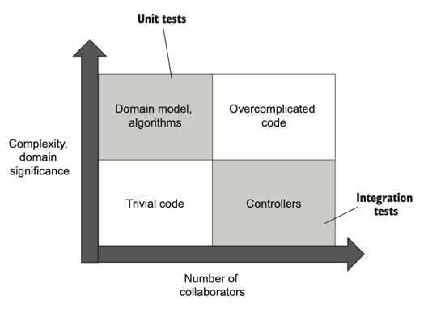
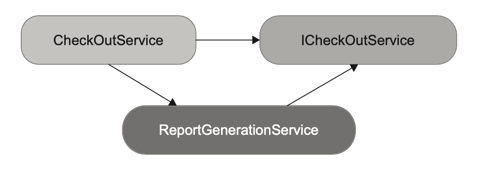
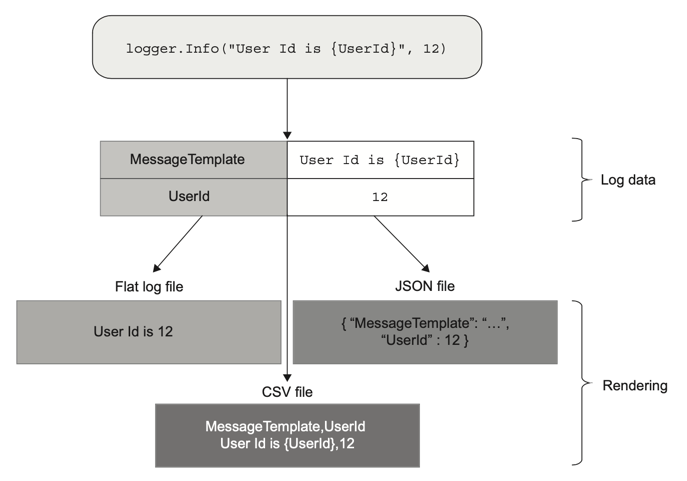

# 8장 통합 테스트를 하는 이유

## 8.1 통합 테스트는 무엇인가?

### 8.1.1 통합 테스트의 역할
* 단위 테스트의 세 가지 요구 사항
  * 단일 동작 단위 검증
  * 빠르게 수행
  * 다른 테스트와 별도로 처리
* 단위 테스트의 세 가지 요구 사항 중 하나라도 충족하지 못하는 테스트 = 통합 테스트
* 통합 테스트: 시스템이 프로세스 외부 의존성과 통합해 어떻게 작동하는지를 검증

* 통합 테스트는 컨트롤러 사분면에 속하는 코드를 테스트한다.
* 컨트롤러여도 모든 프로세스 외부 의존성을 목킹하면 단위 테스트가 될 수 있지만, 대부분의 애플리케이션은 목으로 대체할 수 없는 프로세스 외부 의존성이 있다. (데이터베이스 등)

### 8.1.2 다시 보는 테스트 피라미드
* 단위 테스트와 통합 테스트 간의 균형 유지가 중요!
* 통합 테스트의 특징
  * 느리다! -> 프로세스 외부 의존성을 많이 가지고 있음
  * 유지비가 올라간다! -> 프로세스 외부 의존성 운영 필요, 관련된 협력자가 많아서 테스트가 커짐
  * 회귀 방지가 우수하다! -> 코드를 더 많이 거침
* 단위 테스트와 통합 테스트의 비율
  * 단위 테스트로는 비즈니스 시나리오의 예외 상황을 가능한 한 많이 확인
  * 통합 테스트로는 주요 흐름<sup>happy path, 시나리오의 성공적인 실행</sup>과 단위 테스트가 다루지 못하는 기타 예외 상황<sup>edge case, 비즈니스 시나리오 수행 중 오류가 발생하는 경우</sup> 확인
  * 비율은 대부분 단위 테스트로 하고 통합 테스트는 비즈니스 시나리오당 한 두 개 정도가 좋다.
* 단순 애플리케이션은 도메인 모델과 알고리즘 코드가 거의 없어서 단위 테스트가 적다. 따라서 테스트 피라미드 모양이 직사각형이 된다.
* 단순한 애플리케이션이라도 통합 테스트는 가치가 있다. 다른 시스템과 통합해 어떻게 작동하는지 확인하는 것이 중요하다.

### 8.1.3 통합 테스트와 빠른 실패
* 통합 테스트에서 프로세스 외부 의존성과의 상호 작용을 모두 확인하려면 가장 긴 주요 흐름을 선택하라. 
그런 흐름이 없다면 모든 프로세스 외부 의존성과 통신을 테스트할 통합 테스트를 여러 개 작성하라.
* 어떤 시나리오가 예외 상황으로 전체 애플리케이션이 즉시 실패하면 통합 테스트를 작성할 필요가 없는 상황이다. -> 단위 테스트를 하자.
* 빠른 실패 원칙<sup>Fast Fail principle</sup>
  * 예기치 않은 오류가 발생하자마자 현재 연산을 중단하는 것
  * 빠른 실패 원칙이 애플리케이션의 안정성을 높이는 이유
    * 피드백 루프 단축: 버그를 빨리 발견할수록 더 쉽게 해결할 수 있다.
    * 지속성 상태 보호: 버그는 애플리케이션 상태를 손상시킨다. 빨리 실패하면 손상이 확산되는 것을 막을 수 있다.
  * 보통 예외를 던져서 현재 연산을 중지한다. 예외는 프로그램 흐름을 중단하고 실행 스택에서 가장 높은 레벨로 올라간 후 로그를 남기고 작업을 종료하거나 재시작할 수 있다.
  * 빠른 실패 원칙의 예
    * 전제 조건이 실패하면 버그이다.
    * 설정 파일에서 데이터를 읽었을 때 데이터가 불완전하거나 잘못된 경우 예외가 발생하도록 할 수 있다.

## 8.2 어떤 프로세스 외부 의존성을 직접 테스트해야 하는가?
* 프로세스 외부 의존성 검증 구현 방식 1 -> 실제 프로세스 외부 의존성 사용
* 프로세스 외부 의존성 검증 구현 방식 2 -> 해당 의존성을 목으로 대체

### 8.2.1 프로세스 외부 의존성의 두 가지 유형
* 관리 의존성
  * 전체를 제어할 수 있는 프로세스 외부 의존성
  * 애플리케이션을 통해서만 접근할 수 있다.
  * 해당 의존성과의 상호 작용은 외부 환경에서 볼 수 없다.
  * 예: 데이터베이스
  * 구현 세부 사항
  * 목 사용 OR 실제 인스턴스 사용
    * 관리 의존성에 대한 통신 패턴은 하위 호환성을 유지할 필요가 없으므로 목이 아니어도 된다. 
    * 통합 테스트에서 관리 의존성에 실제 인스턴스를 사용하면 외부 클라이언트 관점에서 **최종 상태**를 확인할 수 있다. 
  * 컬럼 이름을 변경하거나 데이터베이스 이관 등 데이터베이스 리팩터링에도 도움이 된다.
* 비관리 의존성
  * 전체를 제어할 수 없는 프로세스 외부 의존성
  * 해당 의존성과의 상호 작용을 외부에서 볼 수 있다.
  * 예: SMTP 서버, 메시지 버스
  * 식별할 수 있는 동작
  * 목 사용 OR 실제 인스턴스 사용
    * 비관리 의존성에 대한 통신 패턴을 유지해야 하는 것은 하위 호환성을 지키기 위해서이고, 이 작업에는 목이 제격이다. 
    * 목을 사용하면 모든 가능한 리팩터링을 고려해서 통신 패턴 영속성을 보장할 수 있다.

### 8.2.2 관리 의존성이면서 비관리 의존성인 프로세스 외부 의존성 다루기
* 다른 애플리케이션이 접근할 수 있는 데이터베이스는 관리 의존성이면서 비관리 의존성이다.
* 시스템 간의 통합을 구현할 때 데이터베이스를 사용하면 시스템이 서로 결합되고 추가 개발을 복잡하게 만들기 때문에 좋지 않다. API 나 메시지 버스를 사용하라.
* 이미 공유 데이터베이스가 있다면? 
  * 다른 애플리케이션에서 볼 수 있는 테이블을 비관리 의존성으로 취급하라. (테이블이 메시지 버스, 각 행이 메시지 역할을 하는 것)
  * 나머지 테이블은 관리 의존성으로 취급하고, 데이터베이스와의 상호 작용이 아닌 데이터베이스의 최종 상태를 확인하라.
  * 공유 테이블과의 상호 작용하는 방식을 가급적이면 변경하지 말라. 다른 애플리케이션에 영향이 갈 수 있다.

### 8.2.3 통합 테스트에서 실제 데이터베이스를 사용할 수 없으면 어떻게 할까?
* 어떠한 경우에도 데이터베이스는 관리 의존성이므로 목으로 대체하면 안된다. 목으로 대체하면 리팩터링 내성도 저하되고, 회귀 방지도 떨어진다.
* 데이터베이스가 프로젝트에서 유일한 프로세스 외부 의존성일 때 목으로 대체하면, 통합 테스트는 회귀 방지 수준이 단위 테스트 정도밖에 안된다.
* 데이터베이스를 그대로 테스트할 수 없으면 통합 테스트를 아예 작성하지 말고 도메인 모델의 단위 테스트만 하라.
* 가치가 충분하지 않은 테스트는 테스트 스위트에 두지 말라.

## 8.3 통합 테스트: 예제
* 7장의 샘플 CRM 시스템을 사용한다.

### 8.3.1 어떤 시나리오를 테스트할까?
* 통합 테스트에서는 가장 긴 주요 흐름과 단위 테스트로는 수행할 수 없는 모든 예외 상황을 다루는 게 좋다.
* CRM 프로젝트에서 가장 긴 주요 흐름은 기업 이메일에서 일반 이메일로 변경하는 것이다.
  * 데이터베이스 - **사용자**의 이메일, **회사**의 직원 수가 업데이트된다.
  * 메시지 버스 - 메시지 보냄
* 단위 테스트로 수행할 수 없는 예외 상항
  * 이메일을 변경할 수 없는 시나리오 - 컨트롤러에서 `canChangeEmail`을 확인하지 않으면 애플리케이션이 빨리 실패하므로 테스트할 필요가 없다.

### 8.3.2 데이터베이스와 메시지 버스 분류하기
* 데이터베이스 - 관리 의존성이므로 실제 인스턴스를 사용한다.
* 메시지 버스 - 비관리 의존성이므로 목으로 대체한다.

### 8.3.3 엔드 투 엔드 테스트는 어떤가?
* 대부분의 경우 통합 테스트(관리 의존성은 실제 인스턴스로, 비관리 의존성은 목으로 대체)의 보호 수진이 엔드 투 엔드 테스트와 비슷해지므로 생략할 수 있다.
* 하지만 배포 후 프로젝트 상태 점검을 위해 한 개 또는 두 개 정도 엔드 투 엔드 테스트를 작성할 수 있다.
* 메시지 버스는 직접 확인하고, 데이터베이스 상태는 애플리케이션을 통해 검증한다.

### 8.3.4 통합 테스트: 첫 번째 시도
```kotlin
    @Test
    fun `changing email from corporate to non corporate`(){
        // Arrange
        val db = Database(connectionString)
        val user = createUser("user@mycorp.com", UserType.EMPLOYEE, db)
        createCompany("mycorp.com", 1, db)

        val messageBusMock = mockk<IMessageBus>()
        val sut = UserController(db, messageBusMock)

        // Act
        val result = sut.changeEmail(user.userId, "new@gmail.com")

        // Assert
        assertEquals("OK", result)

        val userData = db.getUserById(user.userId)
        val userFromDb = UserFactory.create(userData)
        assertEquals("new@gmail.com", userFromDb.email)
        assertEquals(UserType.CUSTOMER, userFromDb.type)

        val companyData = db.getCompany()
        val companyFromDb = CompanyFactory.create(companyData)
        assertEquals(0, companyFromDb.numberOfEmployees)

        verify(exactly = 1) { messageBusMock.sendEmailChangedMessage(user.userId, "new@gmail.com") }
    }

    private fun createUser(email: String, type: UserType, database: Database): User {
        val user = User(0, email, type, false)
        database.saveUser(user)
        return user
    }

    private fun createCompany(domainName: String, numberOfEmployees: Int, database: Database): Company {
        val company = Company(domainName, numberOfEmployees)
        database.saveCompany(company)
        return company
    }
```
*예제 8.2 통합 테스트*
* 테스트는 Arrange 구절에서 `user`와 `company`를 데이터베이스에 삽입하지 않고, `createUser`와 `createCompany` 헬퍼 메서드를 호출한다. 이러한 메서드는 여러 통합 테스트에서 재사용할 수 있다.
* 데이터베이스 상태 확인을 위해 Assert 구절에서 `user`와 `company`를 각각 조회하고, 새로운 `userFromDb`와 `companyFromDb` 인스턴스를 생성한 후에 해당 상태를 검증한다. (쓰기, 읽기 모두 테스트 가능)

## 8.4 의존성 추상화를 위한 인터페이스 사용

### 8.4.1 인터페이스와 느슨한 결합
* 프로세스 외부 의존성을 위해 인터페이스를 도입하는 관습이 있다.
* 일반적인 이유 두 가지와 그에 대한 오해
  * 프로세스 외부 의존성을 추상화해 느슨한 결합 달성?
    * 단일 구현체를 위한 인터페이스는 추상화가 아니다!
    * 인터페이스를 사용한다고 해서 결합도가 줄어드는 게 아니다.
    * 추상화는 구현체가 적어도 두 가지 이상은 있어야 한다.
  * 기존 코드 변경 없이 새로운 기능 추가가 용이하므로 개방 폐쇄 원칙<sup>OCP, Open-Closed principle</sup> 지킴?
    * YAGNI(You aren't gonna need it, 현재 필요하지 않은 기능에 시간을 들이지 말라) 위반!
    * 향후 기능이 어떤지 설명하려고 기능을 개발해서도, 기존 코드를 수정해서도 안된다.
      * 현재 비즈니스적으로 필요하지 않은 기능에 시간을 보내는 것은 시간 낭비다.
      * 프로젝트 코드는 적을수록 좋다. 해결책에 필요한 코드는 적고 간단할수록 좋다.

### 8.4.2 프로세스 외부 의존성에 인터페이스를 사용하는 이유는 무엇인가?
* 프로세스 외부 의존성에 인터페이스를 사용하는 이유 -> 목을 사용하기 위함이다.
* 따라서 목으로 처리할 필요가 없는 외부 의존성(=관리 의존성)은 인터페이스를 두지 말라.
* 즉 비관리 의존성이나 진정한 추상화(구현이 둘 이상인 추상화)에 대해서만 인터페이스를 사용하라.

### 8.4.3 프로세스 내부 의존성을 위한 인터페이스 사용
* 프로세스 내부 의존성도 마찬가지로 구현이 하나만 있으면 인터페이스를 사용하지 말라.
* 인터페이스를 도입하는 이유는 목으로 대체하기 위함인데, 프로세스 내부 의존성을 목으로 대체하면 구현 세부 사항과 결합된 테스트가 되어 리팩터링 내성이 떨어진다.

## 8.5 통합 테스트 모범 사례

### 8.5.1 도메인 모델 경계 명시하기
* 도메인 모델에 명시적 경계를 지정하면 코드에서 도메인 지식의 모음을 더 잘 보여줄 수 있다.
* 패키지 구조로 경계를 나타낼 수 있다.

### 8.5.2 계층 수 줄이기
* 대부분의 프로그래머는 간접 계층을 추가해서 코드를 추상화하고 일반화하려고 한다.
* 애플리케이션에 추상 계층이 너무 많으면 코드베이스 탐색이나 숨은 로직 이해가 어려워진다.
* 추상화가 지나치게 많으면 단위 테스트와 통합 테스트에도 방해가 된다.
  * 추상화가 많은 코드는 각 계층을 따로 검증하는 경향이 강해져서 통합 테스트의 가치가 떨어진다.
  * 또한 특정 계층의 코드만 실행하고 하위 계층은 목으로 처리하게 되어 리팩터링 내성이 떨어지고 회귀 방지에 불리하다.
* 가능한 한 간접 계층을 적게 사용하라.
* 도메인 계층, 애플리케이션 계층, 인프라 계층만 활용하자.
  * 도메인 계층: 도메인 로직
  * 애플리케이션 계층: 외부 클라이언트에 대한 진입점 제공 및 도메인 클래스와 프로세스 외부 의존성 간의 작업 조정
  * 인프라 계층: 데이터베이스 저장소나 ORM 매핑, SMTP 게이트웨이 등이 이 계층에 있고, 프로세스 외부 의존성과 작동함

### 8.5.3 순환 의존성 제거하기
* 순환 의존성<sup>circular dependency, cyclic dependency</sup>: 둘 이상의 클래스가 제대로 작동하고자 직간접적으로 서로 의존하는 것
```kotlin
class CheckOutService {
  fun checkOut(orderId: Int) {
      val service = ReportGenerationService()
      service.generateReport(orderId, this)
      /* 기타 코드 */
  }
}

class ReportGenerationService {
    fun generateReport(orderId: Int, checkOutService: CheckOutService) {
        /* 생성이 완료되면 checkOutService 호출 */
    }
}
```
* 대표적인 예: 콜백<sup>callback</sup> -> 클래스 A에서 클래스 B의 메서드를 호출한 후 해당 메서드가 다시 클래스 A의 메서드를 호출하는 식
* 순환 의존성은 코드를 읽고 이해하려고 할 때 알아야 할 것이 많아서 큰 부담이 된다.
* 테스트를 할 때 순환 의존성은 인터페이스에 의존해서 목으로 처리해야 하는 경우가 많다. (도메인 모델 테스트 시 안티 패턴)
* 인터페이스를 사용해도 컴파일 타임 순환 참조만 제거되고 런타임 순환 참조는 여전하다. 순환 참조에 인터페이스 사용까지 더해져 코드에 대한 이해가 힘들어진다. 

*그림 8.11 컴파일 타임에는 순환 참조가 없어지지만 런타임에는 여전히 있는 예시*
* 가장 좋은 방법은 순환 의존성을 제거하는 것이다. `ReportGenerationService`를 리팩터링해서 작업 결과를 `checkOutService`를 호출하는 게 아닌 일반 값으로 리턴하게 하라.
```kotlin
class CheckOutService {
  fun checkOut(orderId: Int) {
      val service = ReportGenerationService()
      val report = service.generateReport(orderId)
      /* 기타 코드 */
  }
}

class ReportGenerationService {
    fun generateReport(orderId: Int) {
        /* ... */
    }
}
```

### 8.5.4 테스트에서 다중 실행 구절 사용
* (3장 참고) 테스트에서 두 개 이상의 준비/실행/검증 구절을 두는 것은 코드 악취<sup>code smell</sup>에 해당한다.
* 통합 테스트에서도 한 테스트에서 두 개 이상의 동작 단위에 초점을 맞추지 말라.
* 원하는 상태로 만들기 어려운 프로세스 외부 의존성으로 동작하는 테스트의 경우 이 지침을 따르지 않아도 된다.
* 즉, 프로세스 외부 의존성을 관리하기가 어려울 때이다.
* 단위 테스트는 프로세스 외부 의존성을 사용하지 않기 때문에 이 지침에서 예외가 되는 경우는 없다.

## 8.6 로깅 기능을 테스트하는 방법

### 8.6.1 로깅을 테스트해야 하는가?
* 로깅은 코드베이스 어느 부분에서나 필요할 수 있다.
* 로깅은 중요하지만 너무나 보편적이어서 테스트 노력을 들일 가치가 있는지 분명하지 않다.
* 로깅은 로그 파일이나 데이터베이스 등에 사이드 이펙트를 초래한다.
  * 개발자 이외의 다른 사람이 볼 수 있다면 식별할 수 있는 동작이다.
  * 개발자만 본다면 구현 세부 사항이다.
* 로깅 유형의 두 가지
  * 지원 로깅<sup>support logging</sup>: 비즈니스 담당자나 시스템 관리자가 추적할 수 있는 메시지 생성
  * 진단 로깅<sup>diagnostic logging</sup>: 개발자가 애플리케이션 내부 상황을 파악할 수 있게 함

### 8.6.2 로깅을 어떻게 테스트해야 하는가?
* 로깅에는 프로세스 외부 의존성이 있기 때문에 테스트를 할 때는 프로세스 외부 의존성에 영향을 주는 다른 기능들과 동일한 규칙이 적용된다.
* 즉 애플리케이션과 로그 저장소 간의 상호 작용을 검증하려면 목을 써야 한다.
* ILogger 위에 래퍼 도입하기
  * ILogger 인터페이스를 목으로 처리하지 말라.
  * 지원 로깅은 비즈니스 요구 사항이므로 명시적으로 코드베이스에 반영하라.
  * 비즈니스에 필요한 모든 지원 로깅을 명시적으로 나열하는 `DomainLogger` 클래스를 만들라.
  ```kotlin
    fun changeEmail(newEmail: String, company: Company) {

        // logging
        logger.info("Changing email for user $userId to $newEmail")

        require(canChangeEmail() == null)

        if (newEmail == this.email) {
            return
        }

        val newType = when(company.isEmailCorporate(newEmail)) {
            true -> UserType.EMPLOYEE
            false -> UserType.CUSTOMER
        }

        if (newType != this.type) {
            val delta = when(newType) {
                UserType.EMPLOYEE -> 1
                else -> -1
            }
            company.changeNumberOfEmployees(delta)
            domainLogger.userTypeHasChanged(userId, type, newType)
        }

        this.email = newEmail
        this.type = newType

        this.emailChangedEvents += EmailChangedEvent(userId, newEmail)

        // logging
        logger.info("Email is changed for user $userId")
    }
  ```
  *예제 8.4 DomainLogger 클래스에 대한 지원 로그 추출*
  * 진단 로깅은 기존 로거(`ILogger`)를 사용하지만, 지원 로깅은 이제 `IDomainLogger` 타입의 새로운 로거를 사용한다.
  ```kotlin
    class DomainLogger(
      private val logger: ILogger,
    ) : IDomainLogger {
      override fun userTypeHasChanged(userId: Int, oldType: UserType, newType: UserType) {
         logger.info("User $userId changed type from $oldType to $newType")
      }
    }
  ```
  *예제 8.5 ILogger 위의 래퍼로 사용되는 DomainLogger*
  * `DomainLogger`는 `ILogger` 위에서 작동한다.
  * 비즈니스에 필요한 특정 로그 항목을 선언하는 방식이다.
  * 구현이 구조화된 로깅 개념과 매우 유사해서 로그 파일의 후처리와 분석의 유연성이 올라간다.
* 구조화된 로깅<sup>structured logging</sup> 이해하기
  * 로그 데이터 캡처와 렌더링을 분리하는 로깅 기술이다.
  * 전통적인 로깅과 구조화된 로깅의 차이
    * 전통적인 로깅 -> `logger.info("User Id is " + 12)`
    * 구조화된 로깅 -> `logger.info("User Id is {userId}", 12)`
  * 구조화된 로깅의 동작 방식
    1. 메시지 템플릿의 해시를 계산하고 해당 해시를 입력 매개변수와 결합해 캡처한 데이터 세트를 형성한다.
    2. 평범한 로그 파일, JSON, CSV 파일 등으로 데이터를 렌더링한다. 
  
  * 예제 8.5의 `DomainLogger`는 구조화된 로깅은 아니지만 동일한 방식으로 작동한다.
  * `userTypeHasChanged()` 메서드를 메시지 템플릿의 해시로 볼 수 있다. 이 해시에 `userId`, `oldType`, `newType` 매개변수를 덧붙여 로그 데이터를 만든다.
* 지원 로깅과 진단 로깅을 위한 테스트 작성
  * `DomainLogger`에는 프로세스 외부 의존성이 있다. `User`가 `DomainLogger`과 상호 작용하므로 비즈니스 로직과 프로세스 외부 의존성이 직접 통신하는 상태이다. -> 문제 있음
  * `DomainLogger`를 사용하는 `User`는 결국 지나치게 복잡한 코드가 되어 버린다.
  * 이 문제를 도메인 이벤트를 도입해서 해결해보자.
  ```kotlin
    fun changeEmail(newEmail: String, company: Company) {

        // logging
        logger.info("Changing email for user $userId to $newEmail")

        require(canChangeEmail() == null)

        if (newEmail == this.email) {
            return
        }

        val newType = when(company.isEmailCorporate(newEmail)) {
            true -> UserType.EMPLOYEE
            false -> UserType.CUSTOMER
        }

        if (newType != this.type) {
            val delta = when(newType) {
                UserType.EMPLOYEE -> 1
                else -> -1
            }
            company.changeNumberOfEmployees(delta)
            addDomainEvent(UserTypeChangedEvent(userId, type, newType)) // domain event
        }

        this.email = newEmail
        this.type = newType

        addDomainEvent(EmailChangedEvent(userId, newEmail)) // domain event

        // logging
        logger.info("Email is changed for user $userId")
    }
  ```
  *예제 8.6 User 의 DomainLogger 를 도메인 이벤트로 교체*
  * 사용자 유형 변경 사항을 처리하고자 하는 도메인 이벤트 `UserTypeChangedEvent`를 도입했다.
  ```kotlin
    fun changeEmail(userId: Int, newEmail: String): String {
        val data = database.getUserById(userId)
        val user = UserFactory.create(data)

        val companyData = database.getCompany()
        val company = CompanyFactory.create(companyData)

        val error = user.canChangeEmail()
        error ?.let { return error }

        user.changeEmail(newEmail, company)

        database.saveCompany(company)
        database.saveUser(user)
        EventDispatcher.dispatch(user.domainEvents) // domain event -> 외부 의존성 호출로 변환해줌

        return "OK"
    }
  ```
  *예제 8.7 UserController 의 현재 버전*
  * `EventDispatcher`는 도메인 이벤트를 프로세스 외부 의존성으로 변환해주는 새로운 클래스이다.
    * `EmailChangedEvent` -> `messageBus.sendMailChangedMessage()`
    * `UserTypeChangedEvent` -> `domainLogger.userTypeHasChanged()`
  * 이제 도메인 로직과 프로세스 외부 의존성 통신 두 가지 책임을 나눠서 테스트할 수 있다!
    * 도메인 로직(`UserTypeChangedEvent`) - 단위 테스트
    * 프로세스 외부 의존성 통신(`DomainLogger`와의 상호 작용) - 통합 테스트
  * 도메인 로직이 아닌 컨트롤러에서는 지원 로깅 시 도메인 이벤트를 사용할 필요가 없다. 컨트롤러는 프로세스 외부 의존성을 사용해도 되기 때문이다.
  * `User`에는 진단 로깅도 여전히 있다. 이는 구현 세부 사항이므로 테스트할 필요가 없다.
  * 그래도 가능하면 도메인 클래스에서 진단 로깅을 사용하지 말라. 이유는 다음 절에서...

### 8.6.3 로깅이 얼마나 많으면 충분한가?
* 지원 로깅은 비즈니스 요구 사항이므로 필요한 양이 정해져 있다.
* 진단 로깅은 과도하게 사용하지 않는 것이 중요하다.
  * 이유 1: 과도한 로깅은 코드를 혼란스럽게 한다. 특히 도메인 모델에서는 사용하지 않는 게 좋다.
  * 이유 2: 로그의 양이 너무 많으면 필요한 정보를 찾기가 어려워진다. (신호 대비 잡음 비율에 비유)
* 도메인 모델에서는 진단 로깅을 디버깅할 때만 사용하고, 디버깅 후에는 제거하라.

### 8.6.4 로거 인스턴스를 어떻게 전달하는가?
```kotlin
class User(val userId: Int, email: String, type: UserType, isEmailConfirmed: Boolean) {

  // 정적 메서드를 통해 ILogger 를 처리하고 private static 필드에 저장
  companion object {
    private val logger: ILogger = LogManager.getLogger(User::class.java)
  }

  fun changeEmail(newEmail: String, company: Company) {

    // logging
    logger.info("Changing email for user $userId to $newEmail")

    /* ... */

    // logging
    logger.info("Email is changed for user $userId")
  }
}
```
*예제 8.8 정적 필드에 ILogger 저장*
* 클래스가 로거 인스턴스를 전달받는 한 가지 방법: 정적 메서드 사용
  * 이러한 유형의 의존성을 앰비언트 컨텍스트<sup>ambient context</sup>라고 부름
  * 의존성이 숨어있고 변경이 어려우며 테스트가 어렵기에 **안티 패턴**이다.
  * 가장 큰 단점은 코드의 잠재적인 문제를 가리는 것이다.
* 로거를 명시적으로 주입하는 방법: 메서드 argument 로 의존성 주입 또는 클래스 생성자를 통합 의존성 주입
```kotlin
    fun changeEmail(newEmail: String, company: Company, logger: ILogger) {
      // logging
      logger.info("Changing email for user $userId to $newEmail")
  
      /* ... */

      // logging
      logger.info("Email is changed for user $userId")
    }
```
*예제 8.9 명시적인 로거 주입*

## 8.7 결론
* 프로세스 외부 의존성과의 통신은 **식별할 수 있는 동작**인지 **구현 세부 사항**인지를 가지고 살펴보자.
* 로그 저장소도 **식별할 수 있는 동작**인지 **구현 세부 사항**인지를 가지고 판단하자.
* 개발자만 보는 로그가 아니면 -> 목으로 처리 / 개발자만 보는 로그이면 -> 테스트할 필요 X