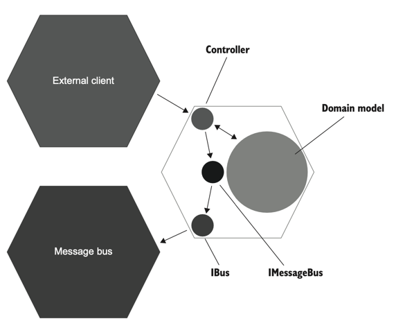
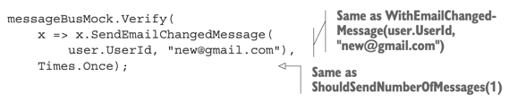

# 9장 목 처리에 대한 모범 사례
## 9.1 목의 가치를 극대화하기
* 예를 들어 설명하기 위해 이전 장의 CRM 시스템을 샘플 프로젝트로 사용한다.
```kotlin
class UserController(
    private val database: Database,
    private val messageBus: IMessageBus,
    private val domainLogger: IDomainLogger,
) {
    private val eventDispatcher = EventDispatcher(messageBus, domainLogger)

    fun changeEmail(userId: Int, newEmail: String): String {
        val data = database.getUserById(userId)
        val user = UserFactory.create(data)

        val companyData = database.getCompany()
        val company = CompanyFactory.create(companyData)

        val error = user.canChangeEmail()
        error ?.let { return error }

        user.changeEmail(newEmail, company)

        database.saveCompany(company)
        database.saveUser(user)
        eventDispatcher.dispatch(user.domainEvents)

        return "OK"
    }
}
```
*예제 9.1 사용자 컨트롤러*
* 현재 컨트롤러 코드 - 사용자 이메일 변경이라는 하나의 유스케이스. 진단 로깅은 없고 지원 로깅만 남음.
```kotlin
class EventDispatcher(
    private val messageBus: IMessageBus,
    private val domainLogger: IDomainLogger,
) {

    fun dispatch(events: List<IDomainEvent>) {
        for (event in events) {
            dispatch(event)
        }
    }

   private fun dispatch(event: IDomainEvent) {
        when(event) {
            is EmailChangedEvent -> messageBus.sendEmailChangedMessage(event.userId, event.newEmail)
            is UserTypeChangedEvent -> domainLogger.userTypeHasChanged(event.userId, event.oldType, event.newType)
        }
    }
}
```
*예제 9.2 EventDispatcher*
* `EventDispatcher` 클래스 - 도메인 모델에서 생성된 도메인 이벤트를 비관리 의존성 호출로 변경
```kotlin
    @Test
    fun `changing email from corporate to non corporate`(){
        // Arrange
        val db = Database(connectionString)
        val user = createUser("user@mycorp.com", UserType.EMPLOYEE, db)
        createCompany("mycorp.com", 1, db)

        val messageBusMock = mockk<IMessageBus>()
        val domainLoggerMock = mockk<IDomainLogger>()
        val sut = UserController(db, messageBusMock, domainLoggerMock)

        // Act
        val result = sut.changeEmail(user.userId, "new@gmail.com")

        // Assert
        assertEquals("OK", result)

        val userData = db.getUserById(user.userId)
        val userFromDb = UserFactory.create(userData)
        assertEquals("new@gmail.com", userFromDb.email)
        assertEquals(UserType.CUSTOMER, userFromDb.type)

        val companyData = db.getCompany()
        val companyFromDb = CompanyFactory.create(companyData)
        assertEquals(0, companyFromDb.numberOfEmployees)

        verify(exactly = 1) { messageBusMock.sendEmailChangedMessage(user.userId, "new@gmail.com") }
        verify(exactly = 1) { domainLoggerMock.userTypeHasChanged(user.userId, UserType.EMPLOYEE, UserType.CUSTOMER) }
    }
```
*예제 9.3 통합 테스트*
* 통합 테스트 - 모든 프로세스 외부 의존성을 거침. 비관리 의존성 `IMessageBus`, `IDomainLogger`를 목으로 처리.

### 9.1.1 시스템 끝에서 상호 작용 검증하기
* *예제 9.3*의 통합 테스트에서 사용했던 목이 회귀 방지와 리팩터링 내성 측면에서 이상적이지 않은 이유와 해결법을 알아보자.
> 목을 사용할 때 항상 다음 지침을 따르자. 시스템 끝에서 비관리 의존성과의 상호 작용을 검증하라.
* 문제점 1: `messageBusMock`의 인터페이스 `IMessageBus` 인터페이스가 시스템 끝에 있지 않다!
```kotlin
interface IMessageBus {
    fun sendEmailChangedMessage(userId: Int, newEmail: String)
}

class MessageBus(
  private val bus: IBus,
): IMessageBus {
  override fun sendEmailChangedMessage(userId: Int, newEmail: String) {
    bus.send("Subject: USER; Type: EMAIL CHANGED; Id: $userId; NewEmail: $newEmail")
  }
}

interface IBus {
    fun send(message: String)
}
```
*예제 9.4 메시지 버스*
* `IBus` 인터페이스: 메시지 버스 SDK 라이브러리 위에 있는 래퍼
* `IMessageBus` 인터페이스: `IBus`를 감싸는 래퍼. 도메인 관련 메시지 정의
* `IBus`와 `IMessageBus`를 합치는 방법도 있지만 두 가지 책임은 분리하는 것이 더 낫다.

*그림 9.1 `IBus`는 시스템 끝에 있다. `IMessageBus`는 컨트롤러와 메시지 버스 사이의 타입 사슬에서 중간 고리일 뿐이다. `IMessageBus` 대신 `IBus`를 목으로 처리하면 회귀 방지가 좋아진다.*
* 헥사고날 아키텍처 관점에서 `IBus`는 컨트롤러와 메시지 버스 사이의 타입 사슬에서 마지막 고리이고, `IMessageBus`는 중간에 있다.
* `IMessageBus` 대신 `IBus`를 목으로 처리하면 회귀 방지가 좋아진다.
  * 비관리 의존성과 통신하는 마지막 타입을 목으로 처리하면 통합 테스트가 커버하는 클래스의 수가 증가한다.
* `EventDispatcher`는 시스템 끝에서부터의 거리가 `IMessageBus`보다 더 멀기 때문에 더더욱 목으로 처리하면 안된다.
* `IMessageBus`가 아닌 `IBus`를 목킹해보자.
```kotlin
    @Test
    fun `changing email from corporate to non corporate`(){
        /* ... */

        val busMock = mockk<IBus>()
        val messageBusMock = MessageBus(busMock)
        val domainLoggerMock = mockk<IDomainLogger>()
        val sut = UserController(db, messageBusMock, domainLoggerMock)

        /* ... */
        verify(exactly = 1) { busMock.send("Type: USER; Type: EMAIL CHANGED; Id: ${user.userId}; NewEmail: new@gmail.com") }
    }
```
*예제 9.5 IBus 를 대상으로 한 통합 테스트*
* 이제 테스트에서 `IMessageBus` 인터페이스가 아닌 `MessageBus` 구체 클래스를 사용한다.
* 목으로 처리하기 위해 `IMessageBus` 인터페이스를 두었던 것인데 이제 테스트는 구체 클래스를 사용하므로 이제 이 인터페이스를 삭제해도 된다.
* 텍스트 메시지는 외부에서 식별할 수 있는 사이드 이펙트이므로 이를 검증하는 것이 회귀 방지와 리팩터링 내성에 더 좋다.
* 이러한 텍스트 메시지를 생성하는 데 참여하는 클래스를 검증하는 것은 구현 세부 사항을 검증하는 것이다.
> 비관리 의존성에 대한 호출은 애플리케이션을 떠나기 전에 몇 단계를 거친다. 마지막 단계를 선택하여 테스트를 검증하라. 외부 시스템과의 하위 호환성을 보장하는 가장 좋은 방법이며, 하위 호환성은 목을 통해 달성할 수 있는 목표다.

### 9.1.2 목을 스파이로 대체하기
* 스파이 
  * 목과 같은 목적을 수행하는 테스트 대역
  * 스파이는 수동으로 작성하지만 목은 목 프레임워크의 도움을 받아 생성한다.
  * 직접 작성한 목이라고도 한다.
* 시스템 끝에 있는 클래스인 경우 스파이가 목보다 낫다.
```kotlin
class BusSpy: IBus {
    private val sentMessages = mutableListOf<String>()

    override fun send(message: String) {
        sentMessages.add(message)
    }

    fun shouldSendNumberOfMessages(number: Int): BusSpy {
        Assumptions.assumeTrue(number == sentMessages.size)

        return this
    }

    fun withEmailChangedMessage(userId: Int, newEmail: String): BusSpy {
        val message = "Type: USER EMAIL CHANGED; " +
                "Id: $userId; " +
                "NewEmail: $newEmail"

        Assumptions.assumeTrue(sentMessages.contains(message))

        return this
    }
}
```
*예제 9.6 스파이(직접 작성한 목이라고도 함)*
```kotlin
    @Test
    fun `changing email from corporate to non corporate`(){
        /* ... */

        val busSpy = BusSpy()
        val messageBusMock = MessageBus(busSpy)
        val domainLoggerMock = mockk<IDomainLogger>()
        val sut = UserController(db, messageBusMock, domainLoggerMock)
  
        /* ... */

        busSpy.shouldSendNumberOfMessages(1)
            .withEmailChangedMessage(user.userId, "new@gmail.com")
    }
```
*예제 9.7 예제 9.5에서 스파이 사용*
* `BusSpy`가 제공하는 플루언트 인터페이스<sup>fluent interface</sup>를 사용해서 간결하게 메시지 버스와의 상호 작용을 검증한다.
* 플루언트 인터페이스
  * 여러 가지 검증을 묶을 수 있어 응집도가 높음
  * 쉬운 영어 문장 형성 가능
  * 표현력이 좋아짐


* `IMessageBus`를 목으로 처리했던 버전과 검증문이 유사하다. 이럴 거면 spy 를 왜 쓰지?
  * `BusSpy`도 `IMessageBus`도 모두 `IBus`의 래퍼이므로 검증은 비슷하다.
  * 하지만 `BusSpy`는 테스트 코드에 속하고 `IMessageBus`는 제품 코드에 속한다.
  * 즉 `BusSpy`를 사용하면 검증문이 제품 코드에 의존하지 않는다.
  * `IMessageBus`를 목으로 처리하여 검증문이 제품 코드에 의존하게 되면 제품 코드를 너무 많이 신뢰하게 된다. 이런 경우 메시지 구조 변경 시에 테스트에서 알람을 받을 수 없을 수도 있다.

### 9.1.3 IDomainLogger 는 어떤가?
* `IMessageBus`가 시스템의 끝에 있지 않아서 `IBus`를 통해 상호 작용을 검증하게 되었다.
* `IDomainLogger`도 시스템의 끝에 있지 않으므로 더 끝에 있는 `ILogger`를 대상으로 다시 검증문을 작성해야 하지 않을까?
* 결론: 메시지 버스는 외부 시스템에 대한 하위 호환성을 유지해야 하므로 메시지 구조를 변경하지 않는 것이 중요하지만, 로거는 구조가 중요하지 않기 때문에 그럴 필요가 없다.
* 로거에서 중요한 것은 정확한 구조가 아닌 로그가 있다는 사실과 로그에 있는 정보이다.

## 9.2 목 처리에 대한 모범 사례
* 비관리 의존성에만 목 적용하기
* 시스템 끝에 있는 의존성에 대해 상호 작용 검증하기
* 통합 테스트에서만 목을 사용하고 단위 테스트에서는 사용하지 않기
* 항상 목 호출 수 확인하기
* 보유 타입만 목으로 처리하기

### 9.2.1 목은 통합 테스트만을 위한 것
* 도메인 모델에 대한 테스트 -> 단위 테스트 범주에 속함
* 컨트롤러에 대한 테스트 -> 통합 테스트 범주에 속함
* 목은 비관리 의존성에만 해당하며 컨트롤러만 이러한 의존성을 처리하므로 목은 컨트롤러의 통합 테스트에만 적용해야 한다.

### 9.2.2 테스트당 목이 하나일 필요는 없음
* 단위 테스트의 `단위`는 코드 단위가 아닌 동작 단위이다. 동작 단위이므로 구현하는 데 필요한 코드의 양은 적을 수도 있고 많을 수도 있다.
* 통합 테스트에서 목을 사용하더라도 마찬가지이다. 동작 단위 검증에 필요한 목의 수는 여러 개가 될 수 있다.

### 9.2.3 호출 횟수 검증하기
* 비관리 의존성과의 통신에서 확인해야 하는 것
  * 예상하는 호출이 있는가?
  * 예상치 못한 호출은 없는가?
* 예상하는 호출이 있는가를 확인하는 법
  * 특정 메소드가 특정 횟수만큼 호출되는지 확인한다.
  ```kotlin
  verify(exactly = 1) { messageBusMock.sendEmailChangedMessage(user.userId, "new@gmail.com") }`
  ```
* 예상치 못한 호출은 없는가를 확인하는 법
  * 대부분의 목 라이브러리는 목에 다른 호출이 없는지 명시적으로 확인할 수 있게 도와준다.
  * 내가 사용한 mockk 에는 없다.
  * `Mockito`에는 `Mockito.verifyNoMoreInteractions(mock)`이 있다.
* `BusSpy`도 이러한 기능을 구현한다.
  * `busSpy.shouldSendNumberOfMessages(1)` -> 호출 횟수 검증 + 다른 호출 없음을 검증

### 9.2.4 types that you own 만 목으로 처리하기
* 스티브 프리먼과 냇 프라이스에 의하면 서드파티 라이브러리 위에 항상 어댑터를 작성하고 기본 타입 대신 해당 어댑터를 목으로 처리해야 한다.
* 그들이 이 지침을 주장하는 이유
  * 서드파티 코드 작동 방식에 대해 깊이 이해하지 못하는 경우가 있다.
  * 해당 코드가 내장 인터페이스를 제공하면 목을 사용할 수는 있겠지만 이 동작이 실제 외부 라이브러리와 일치한다는 보장이 없으므로 목으로 처리하는 것은 위험하다.
  * 서드파티 코드의 기술 세부 사항까지는 필요 없으므로 이를 추상화한 어댑터를 통해 애플리케이션 관점에서 라이브러리와의 관계를 정의하는 게 좋다.
* 어댑터: 코드와 외부 환경 사이의 손상 방지 계층<sup>anti-corruption layer</sup>
  * 기본 라이브러리의 복잡성을 추상화하고
  * 라이브러리에서 필요한 기능만 노출하며
  * 프로젝트 도메인 언어를 사용해 수행할 수 있다.
* `IBus`가 바로 어댑터이다.
* 어댑터의 장점 - 라이브러리를 업그레이드할 때 서드파티 코드가 변경되더라도 파급 효과를 제한할 수 있다.
* 프로세스 내부 의존성, 인메모리 의존성, 관리 의존성은 어댑터를 만들 필요가 없다. 어댑터를 목으로 처리하는 것은 비관리 의존성에만 해당하는 것이기 때문이다.
  * 날짜와 시간 API 를 제공하는 라이브러리 - 비관리 의존성에 도달하지 않으므로 어댑터를 만들 필요가 없다.
  * ORM - 외부 애플리케이션에서 볼 수 없는 데이터베이스에 접근한다면 ORM 을 추상화할 필요는 없다.