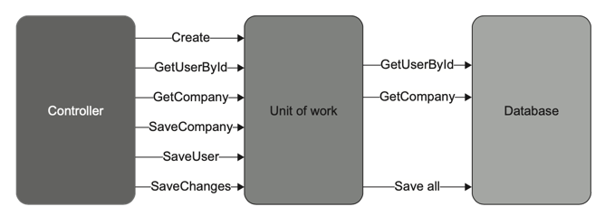
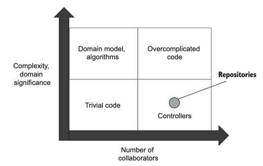

# 10장 데이터베이스 테스트
* 프로세스 외부 관리 의존성의 대표적인 예: 애플리케이션 데이터베이스 (다른 애플리케이션이 접근할 수 없는 데이터베이스)

## 10.1 데이터베이스 테스트를 위한 전제 조건
* 통합 테스트에서는 관리 의존성에 목을 사용하면 안된다.
* 통합 테스트를 위한 준비 단계
  * 형상 관리 시스템에 데이터베이스 유지
  * 모든 개발자를 위한 별도의 데이터베이스 인스턴스 사용
  * 데이터베이스 배포에 마이그레이션 기반 방식 적용

### 10.1.1 데이터베이스를 형상 관리 시스템에 유지
* 데이터베이스를 테스트할 때 가장 먼저 해야할 것은? 데이터베이스 스키마를 일반 코드로 취급하는 것!
  * 일반 코드처럼 Git 과 같은 형상 관리 시스템<sup>source control system</sup>에 저장하라.
* 전용 데이터베이스 인스턴스를 유지 보수하는 프로젝트를 예로 들어보자. (전용 데이터베이스가 뭘까... 개발 DB 같은 걸 말하는 것 같다.)
  * 이러한 프로젝트에서 전용 데이터베이스 인스턴스가 기준점<sup>reference point, 모델 데이터베이스</sup> 역할을 한다고 가정하자.
  * 개발 중에 스키마 변경 사항이 있으면 전용 데이터베이스에 쌓인다.
  * 운영 배포를 할 때 운영 데이터베이스와 모델 데이터베이스를 비교하고, 업그레이드 스크립트를 생성하고, 해당 스크립트를 실행해야 한다.
  * 전용 데이터베이스를 모델 데이터베이스로 사용하는 것은 안티 패턴이다!
    * 변경 내역 부재 : 데이터베이스 스키마를 과거의 특정 시점으로 되돌릴 수 없어서 운영 환경에서 버그를 재현하기가 어렵다.
    * 복수의 원천 정보 : 개발 상태에 대한 소스 정보가 git 과 모델 데이터베이스로 분산되어 부담이 커진다.
* 형상 관리 시스템에서 관리하면 좋은 점
  * 소스 정보를 한 곳에서 관리할 수 있다.
  * 일반 코드가 변경됨에 따른 데이터베이스 변경을 함께 추적할 수 있다.
* 주의점 : 형상 관리 외부에서는 데이터베이스 구조를 수정하면 안된다.

### 10.1.2 참조 데이터도 데이터베이스 스키마다
* 테이블, 뷰, 인덱스, 저장 프로시저 등등은 데이터베이스 스키마다.
* 그러나 데이터베이스 스키마임에도, 그렇게 여겨지지 않는 참조 데이터<sup>reference data</sup>라는 것이 있다.
> |정의| 참조 데이터는 애플리케이션이 제대로 작동하도록 미리 채워야 하는 데이터다.
* 이전 장의 CRM 시스템을 예로 들어보자. `UserType`의 값으로 사용된 `CUSTOMER`와 `EMPLOYEE`을 테이블로 관리하고자 한다고 가정하면, 이 값들은 미리 insert 되어 있어야 한다.
> |팁| 애플리케이션이 데이터를 수정할 수 있으면 일반 데이터이고, 그렇지 않으면 참조 데이터이다.
* 참조 데이터는 다른 데이터베이스 스키마 요소들과 함꼐 SQL INSERT 문 형태로 형상 관리 시스템에 저장되어야 한다.
* 참조 데이터는 보통 일반 데이터와 별도로 저장되지만, 같은 테이블에 저장되는 경우도 있다. 이러한 경우 참조 데이터라는 것을 표시하는 플래그를 두어 애플리케이션이 변경하지 못하도록 해야 한다.

### 10.1.3 모든 개발자를 위한 별도의 데이터베이스 인스턴스
* 공유 데이터베이스는 개발 프로세스를 방해한다.
  * 서로 다른 개발자가 실행한 테스트는 서로 간섭되기 때문이다.
  * 하위 호환성이 없는 변경으로 다른 개발자의 작업을 막을 수 있기 때문이다.
* 테스트 실행 속도를 높이기 위해서는 개발자마다 (가능하면 개발자 머신에서) 별도로 데이터베이스 인스턴스를 실행하라!

### 10.1.4 상태 기반 데이터베이스 배포와 마이그레이션 기반 데이터베이스 배포
* 데이터베이스 배포의 두 가지 방식
  * 상태 기반 방식
    * 배포 중에 비교 도구가 스크립트를 생성해서 운영 데이터베이스를 모델 데이터베이스와 비교해 최신 상태로 유지하는 방식이다.
    * 상태 기반 방식은 모델 데이터베이스가 소스 데이터가 아니라 모델 데이터베이스의 SQL 스크립트를 이용한다. 해당 스크립트는 형상 관리에 저장된다.
    * 비교 도구는 불필요한 테이블을 삭제하고 새 테이블을 생성하고 컬럼명을 바꾸는 등 모델 데이터베이스와 동기화하는 데 필요한 모든 작업을 수행한다.
  * 마이그레이션 기반 방식
    * 비교 도구를 사용할 수 없고 업그레이드 스크립트를 직접 작성해야 한다.
    * 형상 관리에 저장하는 산출물은 데이터베이스 상태가 아닌 마이그레이션이다.
    * 마이그레이션은 평이한 SQL 스크립트로 표시하지만, SQL 로 변환할 수 있는 DSL 같은 언어를 사용해 작성할 수도 있다.
    * java 기반 마이그레이션 라이브러리는 `Flyway`, `Liquibase` 가 대표적이다.
* 상태 기반 방식보다 마이그레이션 기반 방식을 선호하라.
  * 상태 기반 방식 : 상태를 형상 관리에 저장함으로써 상태를 명시하고 비교 도구가 마이그레이션을 암묵적으로 제어할 수 있게 한다.
  * 마이그레이션 기반 방식 : 마이그레이션을 명시적으로 하지만 상태를 암묵적으로 둔다. 데이터베이스 상태를 직접 볼 수 없으며 마이그레이션으로 조합해야 한다.
  * 상태 기반 방식을 사용해 데이터베이스 상태를 명확하게 하면 병합 충돌을 처리하기가 쉽다.
  * 마이그레이션 기반 방식을 사용해 마이그레이션을 명시적으로 만들면 데이터 모션<sup>data motion</sup>문제를 해결하는 데 도움이 된다.
    > |정의| 데이터 모션은 새로운 데이터베이스 스키마를 준수하도록 기존 데이터의 형태를 변경하는 과정이다.
  * 병합 충돌 완화와 데이터 모션 용이성 중 더 중요한 것은 보통 데이터 모션 용이성이다.
    * 쉽게 폐기할 수 없는 데이터가 반드시 있기 때문이다. 
    * 예를 들어 `name` 컬럼을 `first_name`과 `last_name`으로 나눌 때는 `name` 컬럼을 삭제하고 `first_name`과 `last_name` 컬럼을 만들어야 하며, 기존의 모든 이름도 둘 씩 나누는 스크립트를 작성해야 한다.
    * 데이터 관리의 측면에서는 비교 도구가 쓸모가 없다. 업그레이드 스크립트 생성 시에 적절한 변환을 구현하려면 도메인에 특화된 규칙을 적용해야 한다.
  * 결과적으로 상태 기반 방식은 대다수의 프로젝트에서 실용적이지 않다. 
    * 프로젝트가 아직 운영으로 릴리즈되지 않은 상태라면 일시적으로 상태 기반 방식을 사용할 수는 있다.
    * 하지만 첫 번째 버전 릴리즈 후에는 마이그레이션 기반 방식으로 전환해서 데이터 모션을 처리해야 한다.
> |팁| 마이그레이션을 통해 데이터베이스 스키마 수정 사항을 적용하라. 마이그레이션이 커밋된 후에는 수정하지 말고 새로운 마이그레이션을 생성하라. 잘못된 마이그레이션으로 이해 데이터가 손실될 수 있는 경우에만 이 규칙을 예외로 하라.

## 10.2 데이터베이스 트랜잭션 관리

### 10.2.1 제품 코드에서 데이터베이스 트랜잭션 관리하기
* 샘플 CRM 프로젝트는 Database Connection 을 생성한다. 이 Connection 은 암묵적으로 트랜잭션을 독립적으로 처리한다.
* 결국 `UserController`는 단일 연산 `changeEmail`에서 총 네 개의 데이터베이스 트랜잭션을 생성한다.
```kotlin
    fun changeEmail(userId: Int, newEmail: String): String {
        val data = database.getUserById(userId) // transaction!
        val user = UserFactory.create(data)

        val companyData = database.getCompany() // transaction!
        val company = CompanyFactory.create(companyData)

        val error = user.canChangeEmail()
        error ?.let { return error }

        user.changeEmail(newEmail, company)

        database.saveCompany(company) // transaction!
        database.saveUser(user) // transaction!
        eventDispatcher.dispatch(user.domainEvents)

        return "OK"
    }
```
*예제 10.2 UserController*
* 읽기 전용 연산 중에는 여러 트랜잭션을 열어도 괜찮지만, 데이터 변경이 포함된다면 모순을 피하고자 이 연산에 포함된 모든 업데이트는 원자적이어야 한다.
* 데이터베이스 트랜잭션에서 데이터베이스 연결 분리하기
  * 잠재적인 모순을 피하기 위해 결정해야 하는 부분은 두 가지이다.
    * 업데이트할 데이터
    * 업데이트를 유지할지 롤백할지에 대한 판단
  * `Database` 클래스를 레포지토리<sup>repository</sup>와 트랜잭션으로 나누어 이 책임을 구분할 수 있다.
      * 레포지토리
        * 데이터베이스의 데이터에 대한 접근과 수정을 가능하게 하는 클래스
        * 샘플 프로젝트에는 `User`를 위한 레포지토리와 `Company`를 위한 레포지토리 두 개가 있게 된다.
      * 트랜잭션
        * 데이터 업데이트를 완전히 커밋하거나 롤백하는 클래스
        * 데이터 수정의 원자성 확보를 위해 기본 데이터베이스 트랜잭션에 의존하는 사용자 정의 클래스
    * 레포지토리와 트랜잭션은 수명이 다르다.
      * 레포지토리 : 데이터베이스 호출이 완료되는 즉시 폐기된다.
      * 트랜잭션 : 전체 비즈니스 연산 동안 살아있다.
  * *예제 10.2*에 명시적 트랜잭션을 적용하면 컨트롤러와 데이터베이스 간의 상호 작용을 조정하여 4번의 데이터베이스 호출을 원자적으로 만든다.
  ```kotlin
  class UserController(
      private val transaction: Transaction, // 트랜잭션 인자
      private val messageBus: IMessageBus,
      private val domainLogger: IDomainLogger,
  ) {
      private val userRepository = UserRepository(transaction)
      private val companyRepository = CompanyRepository(transaction)
      private val eventDispatcher = EventDispatcher(messageBus, domainLogger)
  
      fun changeEmail(userId: Int, newEmail: String): String {
          val data = userRepository.getUserById(userId) // 레포지토리 사용
          val user = UserFactory.create(data)
  
          val companyData = companyRepository.getCompany() // 레포지토리 사용
          val company = CompanyFactory.create(companyData)
  
          val error = user.canChangeEmail()
          error ?.let { return error }
  
          user.changeEmail(newEmail, company)
  
          companyRepository.saveCompany(company) // 레포지토리 사용
          userRepository.saveUser(user) // 레포지토리 사용
          eventDispatcher.dispatch(user.domainEvents)
  
          transaction.commit() // 성공 시 트랜잭션 커밋
        
          return "OK"
      }
  }
  
  class UserRepository(
    private val transaction: Transaction,
  ) {
      /* ... */
  }
  
  class Transaction(
    val connectionString: String,
  ) {
    fun commit() {
      /* ... */
    }
  
    fun dispose() {
      /* ... */
    }
  }
  ```
  *예제 10.3 사용자 컨트롤러, 레포지토리, 트랜잭션*
  * `Transaction` 클래스의 두 가지 메서드
    * `commit` : 트랜잭션을 성공적으로 표시한다. 비즈니스 연산이 성공하고 모든 데이터 수정을 저장할 준비가 된 경우에만 호출된다.
    * `dispose` : 트랜잭션을 종료한다. 비즈니스 연산이 끝날 때 항상 호출된다. 이전에 `commit()`이 호출된 경우 `dispose()`는 모든 데이터 업데이트를 저장하고, 그렇지 않으면 롤백한다.
  * `commit()`은 `changeEmail()` 메서드 끝에 위치하므로, 비즈니스 로직 처리 중 오류가 발생하면 실행 흐름이 일찍 반환되어 트랜잭션이 커밋되지 않는다.
  * `commit()` 호출은 의사 결정이 필요하기 때문에 컨트롤러에서 실행된다.
  * `dispose()` 호출은 의사 결정이 필요하지 않기 때문에 인프라 계층의 클래스에 메서드 호출을 위임할 수 있다.
  * 컨트롤러의 클라이언트는 컨트롤러의 작업 수행이 종료된 후 트랜잭션을 폐기해야 한다.
  * 레포지토리는 항상 트랜잭션 위에서 작동하므로 스스로 데이터베이스를 호출할 수 없다.
* 작업 단위로 트랜잭션 업그레이드 하기
  * 작업 단위<sup>unit of work</sup>로 트랜잭션을 업그레이드 하면 더 좋다!
    > |정의| 작업 단위에는 비즈니스 연산의 영향을 받는 객체 목록이 있다. 작업이 완료되면, 작업 단위는 데이터베이스를 변경하기 위해 해야 하는 업데이트를 모두 파악하고 이러한 업데이트를 하나의 단위로 실행한다.(이러한 이유로 패턴 이름이 됨)
  * 일반 트랜잭션 대비 작업 단위의 가장 큰 장점은 업데이트 지연이다.
    * 비즈니스 연산 종료 시점에 모든 업데이트를 실행하므로 데이터베이스 트랜잭션의 기간을 단축하고 데이터 혼잡을 줄인다.
    * 이 패턴은 데이터베이스 호출 수를 줄이는 데도 도움이 된다.
  
  *그림 10.6 작업 단위는 비즈니스 연산이 끝날 때 모든 업데이트를 실행한다.*
  * 대부분의 ORM 라이브러리가 작업 단위 패턴을 구현한다. hibernate 는 작업 단위 패턴을 사용한다.
> 비관계형 데이터베이스에서의 데이터 모순
> * 관계형 데이터베이스에서는 데이터 모순을 피하기 쉽다. 
> * MongoDB 와 같은 비관계형 데이터베이스는 트랜잭션이 없다.
> * 원자적 업데이트는 단일 도큐먼트 내에서만 보장되므로 한 번에 둘 이상의 도큐먼트를 수정하는 비즈니스 연산이 없도록 도큐먼트를 설계해야 한다.
> * 도메인 주도 설계에서는 비즈니스 연산당 둘 이상의 집계를 수정하면 안된다는 지침이 있다. 이 지침은 각 도큐먼트가 하나의 집계에 해당하는 도큐먼트 데이터베이스를 사용하는 시스템에만 적용된다.

### 10.2.2 통합 테스트에서 데이터베이스 트랜잭션 관리하기
* 테스트 구절 간에 데이터베이스 트랜잭션이나 작업 단위를 재사용하지 말라.
* 통합 테스트에서 준비, 실행, 검증 세 구절에 모두 동일한 트랜잭션 또는 작업 단위를 사용하지 말라.
  * 작업 단위를 재사용하는 것은 컨트롤러가 운영 환경에서 하는 것과 다르기 때문에 문제가 된다. 운영 환경에서는 각 비즈니스 연산에 전용 인스턴스가 있어서 컨트롤러 메서드와 생명 주기가 같다.
  * 동작 모순에 빠지지 않으려면 가능한 한 운영 환경과 비슷하게 동작해야 한다. 즉, 실행 구절의 트랜잭션 또는 작업 단위를 다른 것과 공유하지 말라. 
> |팁| 통합 테스트에서 적어도 세 개의 트랜잭션 또는 작업 단위를 사용하라(준비, 실행, 검증 구절당 하나씩).

## 10.3 테스트 데이터 생명 주기
* 공유 데이터베이스 사용 시 통합 테스트를 서로 분리할 수 없는 문제가 있다. 이에 대한 해결책으로 두 가지가 있다.
  * 통합 테스트를 순차적으로 실행하라.
  * 테스트 실행 간에 남은 데이터를 제거하라.

### 10.3.1 병렬 테스트 실행과 순차적 테스트 실행
* 통합 테스트 병렬 수행의 단점
  * 모든 테스트 데이터가 고유한지 확인해서 데이터베이스 제약 조건을 위반하지 않도록 해야 한다.
  * 남은 데이터를 정리하는 것이 어렵다.
* 대부분의 단위 테스트 프레임워크는 일부 테스트에 대해 병렬 처리를 비활성화할 수 있다. 통합 테스트에 이를 적용하자.
* 대안으로 컨테이너를 사용해 테스트를 병렬 처리하는 방법이 있다.
  * 예를 들어 모델 데이터베이스를 도커 이미지로 만들고, 각 통합 테스트를 위해 해당 이미지에서 새 컨테이너를 인스턴스화할 수 있다.
  * 단점
    * 유지 보수 부담이 너무 커진다. 
    * 각 테스트마다 컨테이너 인스턴스가 있는지 확인해야 한다.
    * 통합테스트를 일괄 처리해야 한다.
    * 다 사용한 컨테이너를 폐기해야 한다.
  * 데이터베이스는 개발자당 하나의 인스턴스만 갖는 것이 실용적이므로... 이 방법은 사용하지 말자.

### 10.3.2 테스트 실행 간 데이터 정리
* 테스트 실행 간 남은 데이터 정리 방법 네 가지
  * 각 테스트 전에 데이터베이스 백업 복원하기 -> 단점 : 느리다.
  * 테스트 종료 시점에 데이터 정리하기 -> 단점 : 정리 단계가 누락될 수 있다.
  * 데이터베이스 트랜잭션에 각 테스트를 래핑하고 커밋하지 않기 -> 단점 : 추가 트랜잭션으로 인해 운영 환경과 다른 설정이 생성된다. 
  * 테스트 시작 시점에 데이터 정리하기 -> 이 방법이 가장 좋다.
* 통합 테스트의 베이스 클래스를 두고, 베이스 클래스에 삭제 스크립트를 작성하라. 테스트가 시작될 때마다 스크립트가 실행될 것이다.

### 10.3.3 인메모리 데이터베이스 피하기
* 통합 테스트에서 인메모리 데이터베이스를 사용할 때의 장점
  * 테스트 데이터를 제거할 필요가 없음
  * 작업 속도 향상
  * 테스트가 실행될 때마다 인스턴스화 가능
* 인메모리 데이터베이스는 공유 의존성이 아니므로 단위 테스트가 된다.
* 단점
  * 일반 데이터베이스와 기능이 다르다. 즉 운영 환경과 테스트 환경이 일치하지 않는다.
  * 환경이 달라 거짓 양성 또는 거짓 음성이 발생하기 쉽다.
  * 높은 보호 수준을 기대하기 어렵다.
* 테스트에서도 운영 환경과 같은 DBMS 를 사용하라. 보통 버전이 달라도 괜찮지만, 공급업체는 같아야 한다.

## 10.4 테스트 구절에서 코드 재사용하기
* 통합 테스트는 짧아야 한다.
* 짧은 통합 테스트를 위한 방법 : 비즈니스와 관련이 없는 기술적인 부분을 private 메서드나 헬퍼 클래스로 추출하는 것 

### 10.4.1 준비 구절에서 코드 재사용하기
```kotlin
      @Test
fun `changing email from corporate to non corporate`(){
  // Arrange
  val user: User
  val context = CrmContext(connectionString)
  context.use {
    val userRepository = UserRepository(context)
    val companyRepository = CompanyRepository(context)

    user = User(0, "user@mycorp.com", UserType.EMPLOYEE, false)
    userRepository.saveUser(user)
    val company = Company("mycorp.com", 1)
    companyRepository.saveCompany(company)

    context.saveChanges()
  }

  val busSpy = BusSpy()
  val messageBusMock = MessageBus(busSpy)
  val domainLoggerMock = mockk<IDomainLogger>()

  val result: String

  val context2 = CrmContext(connectionString)
  context2.use {
    val sut = UserController(context2, messageBusMock, domainLoggerMock)
    // Act
    result = sut.changeEmail(user.userId, "new@gmail.com")
  }

  // Assert
  assertEquals("OK", result)

  val context3 = CrmContext(connectionString)
  context3.use {
    val userRepository = UserRepository(context3)
    val companyRepository = CompanyRepository(context)

    val userFromDb = userRepository.getUserById((user.userId))
    assertEquals("new@gmail.com", userFromDb.email)
    assertEquals(UserType.CUSTOMER, userFromDb.type)

    val companyFromDb = companyRepository.getCompany()
    assertEquals(0, companyFromDb.numberOfEmployees)

    busSpy.shouldSendNumberOfMessages(1)
      .withEmailChangedMessage(user.userId, "new@gmail.com")
    verify(exactly = 1) { domainLoggerMock.userTypeHasChanged(user.userId, UserType.EMPLOYEE, UserType.CUSTOMER) }

  }
}
```
*예제 10.7 세 개의 데이터베이스 컨텍스트가 있는 통합 테스트*
```kotlin
private fun createUser(email: String, type: UserType, isEmailConfirmed: Boolean): User {
  val context = CrmContext(connectionString)
  context.use {
    val user = User(0, email, type, isEmailConfirmed)
    val userRepository = UserRepository(context)
    userRepository.saveUser(user)

    context.saveChanges()

    return user
  }
}
```
*예제 10.8 사용자를 생성하는 별도의 메서드*
* 테스트 준비 구절에서 코드를 재사용하는 가장 좋은 방법은 비공개 팩토리 메서드 도입이다.
```kotlin
private fun createUser(
  email: String = "user@mycorp.com", 
  type: UserType = UserType.EMPLOYEE, 
  isEmailConfirmed: Boolean = false): User {
  /* ... */
}
```
*예제 10.9 팩토리 메서드에 기본값 추가*
* 메서드 인수에 대한 기본값을 정의하면 선택적으로 인수를 지정할 수 있어 테스트 단축이 된다. 선택적 인수 지정은 어떤 인수가 테스트 시나리오와 관련이 있는지 강조하기도 좋다.
> 오브젝트 마더, 테스트 데이터 빌더
> * 오브젝트 마더 : 테스트 픽스처(테스트 실행 대상)를 만드는 데 도움이 되는 클래스 또는 메서드
> * 테스트 데이터 빌더 : 오브젝트 마더와 유사하게 작동하지만 일반 메서드 대신 플루언트 인터페이스를 제공
>   * 사용 예
>   ```kotlin
>     val user = UserBuilder()
>                .email("user@mycorp.com")
>                .type(UserType.EMPLOYEE)
>                .build()
>   ```
>   * 테스트 데이터 빌더는 테스트 가독성을 약간 향상시키지만 상용구가 너무 많이 필요하다.

* 팩토리 메서드를 배치할 위치
  * 기본적으로 팩토리 메서드를 동일한 클래스에 배치하라.
  * 코드 복제가 중요한 문제가 될 때만 별도의 헬퍼 클래스를 만들라.
  * 기초 클래스에 팩토리 메서드를 넣지 말라. 기초 클래스는 데이터 정리처럼 모든 테스트에서 실행해야 하는 코드를 위한 클래스이다.

### 10.4.2 실행 구절에서 코드 재사용하기
* *예제 10.7*의 통합 테스트에서는 실행 구절에도 고유의 트랜잭션(작업 단위)이 있다.
* 실행 구절을 줄이기 위해 어떤 컨트롤러 기능을 호출할지에 대한 정보가 있는 delegate 를 받는 메서드를 도입할 수 있다.
* java 의 `Function<T, R>` 사용
```kotlin
private fun execute(
        func: Function<UserController, String>,
        messageBus: MessageBus,
        logger: IDomainLogger,
    ): String {
        val context = CrmContext(connectionString)
        context.use {
            val userController = UserController(context, messageBus, logger)

            return func.apply(userController)
        }
    }
```
*예제 10.11 데코레이터 메서드*
```kotlin
val result = execute(
  func = { x -> x.changeEmail(user.userId, "new@gmail.com") }, 
  messageBus = messageBusMock, 
  logger = domainLoggerMock
)
```
* 데코레이터<sup>decorator</sup> 메서드를 사용한 테스트의 실행 구절

### 10.4.3 검증 구절에서 코드 재사용하기
```kotlin
private fun queryUser(userId: Int): User {
  val context = CrmContext(connectionString)
  context.use {
    val userRepository = UserRepository(context)
    return userRepository.getUserById(userId)
  }
}

private fun queryCompany(): Company {
  val context = CrmContext(connectionString)
  context.use {
    val companyRepository = CompanyRepository(context)
    return companyRepository.getCompany()
  }
}
```
*검증을 위한 새로운 헬퍼 메서드*
* 헬퍼 메서드를 통해 검증 구절도 줄일 수 있다.
* 데이터 검증을 위한 플루언스 인터페이스 도입을 해보자.
```kotlin
fun User.shouldExist(): User {
    Assertions.assertNotNull(this)
    return this
}

fun User.withEmail(email: String): User {
    assertEquals(email, this.email)
    return this
}

fun User.withType(type: UserType): User {
    assertEquals(type, this.type)
    return this
}

fun Company.shouldExist(): Company {
    Assertions.assertNotNull(this)
    return this
}

fun Company.withNumberOfEmployees(): Company {
    Assertions.assertNotEquals(0, this.numberOfEmployees)
    return this
}
```
*예제 10.13 데이터 검증을 위한 플루언트 인터페이스*
```kotlin
val userFromDb = queryUser(user.userId)
userFromDb
    .shouldExist()
    .withEmail("new@gmail.com")
    .withType(UserType.CUSTOMER)

val companyFromDb = queryCompany()
companyFromDb
    .shouldExist()
    .withNumberOfEmployees()
```
*플루언트 인터페이스를 검증 구절에 적용한 모습*

### 10.4.4 테스트가 데이터베이스 트랜잭션을 너무 많이 생성하는가?
* 이전에는 데이터베이스 트랜잭션을 세 개만 사용했으나 이 테스트는 트랜잭션을 5개 사용한다.
* 테스트가 느려지기는 하지만 할 수 있는 것이 많지 않다.
* 빠른 피드백과 유지 보수성 간의 트레이드 오프 상황인데, 이는 유지 보수성을 위해 성능을 양보해야 하는 상황이다.

## 10.5 데이터베이스 테스트에 대한 일반적인 질문

### 10.5.1 읽기 테스트를 해야 하는가?
* 쓰기를 철저하게 테스트 하는 것은 매우 중요하다. 위험성이 높기 때문에.
* 읽기는 이에 해당하지 않는다. 읽기 작업은 버그가 발생해도 해로운 문제가 없다.
* 따라서 가장 복잡하거나 중요한 읽기 작업만 테스트하고 나머지는 무시해도 된다.
* 읽기에는 도메인 모델도 필요 없다. 도메인 모델의 주요 목표는 캡슐화인데, 캡슐화는 변경 사항이 있어도 데이터 일관성을 보장하기 위한 장치이다.
* 데이터 변경이 없으면 읽기 캡슐화는 의미가 없다. 따라서 불필요한 추상화 계층을 가진 ORM 도 필요 없다.
* 읽기에는 추상화 계층이 거의 없기 때문에 단위 테스트가 소용 없고, 테스트할 거면 통합 테스트를 하라.

### 10.5.2 리포지터리 테스트를 해야 하는가?
* 레포지토리가 도메인 객체를 어떻게 데이터베이스에 매핑하는지를 테스트하는 것은 유익할 수 있지만 유지비가 높고 회귀 방지가 떨어진다.
  * 높은 유지비
    
    * 레포지토리는 컨트롤러 사분면에 속하는 코드이다. (복잡도 X, 프로세스 외부 의존성인 데이터베이스와 통신)
    * 데이터베이스와 통신하기 때문에 테스트의 유지비가 올라간다.
    * 다른 통합 테스트들과 비교했을 때 레포지토리를 (통합) 테스트 하는 것은 가성비가 떨어진다.
  * 낮은 회귀 방지
    * 레포지토리는 복잡하지 않기 때문에 일반적인 통합 테스트가 제공하는 회귀 방지가 겹친다.
    * 레포지토리를 테스트할 때는 레포지토리 자체를 테스트하는 것보다 레포지토리가 가진 약간의 복잡도를 알고리즘으로 추출하여 그것을 테스트하는 것이 좋다.
    * ORM 을 사용할 때는 데이터 매핑과 데이터베이스 상호 작용 간의 분리가 불가능하므로 둘을 분리하여 테스트할 수 없다.
    * 그러므로 레포지토리를 테스트할 때는 직접 테스트하지 말고, 포괄적인 통합 테스트의 일부로 생각하자.
    * `EventDispatcher` 또한 목 체계가 복잡하고 회귀 방지 기능이 떨어지므로 테스트하지 말라.

## 10.6 결론
* 데이터베이스 테스트를 잘 만들면 회귀 방지가 뛰어나다.
* 데이터베이스 리팩터링, ORM 전환, DBMS 변경 등에 도움이 된다.
* 관리 의존성에 직접 작동하는 통합 테스트는 대규모 리팩터링에서 발생하는 버그로부터 보호하기에 가장 효율적인 방법이다.